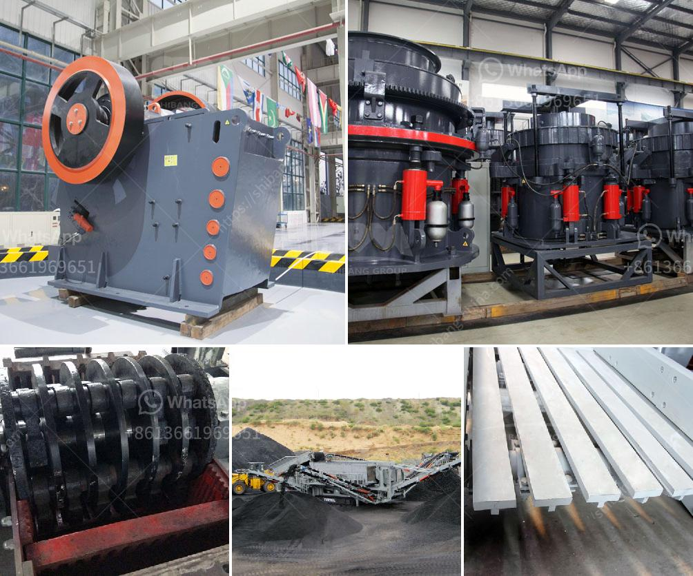

<h3>how much does ball mill cost</h3>
Ball mill is one of the most important grinding mills in the mining industry which is used to break all kinds of minerals and other materials in the industries of ore beneficiation, construction materials and chemical engineering. There are two grinding modes: wet type and dry type. The discharging ways can be divided to grid type and over flow type. Ball mills are in many shapes: short drum one, long drum one, pipe one and cone-shaped one.

The ball mill made by the Chinese ball grinder manufacturer is a grid shaped one made up of a horizontal type cylinder rotating device, gear drive and two cabins. There are two grinding modes: wet type and dry type. The discharging ways can be divided to grid type and over flow type. Ball mills are in many shapes: short drum one, long drum one, pipe one and cone-shaped one. The ball mill made by the Chinese ball grinder manufacturer is a grid shaped one made up of a horizontal type cylinder rotating device, gear drive and two cabins. There are two grinding modes: wet type and dry type. The discharging ways can be divided to grid type and over flow type.

Ball mills are in many shapes: short drum one, long drum one, pipe one and cone-shaped one. The ball mill made by the Chinese ball grinder manufacturer is a grid shaped one made up of a horizontal type cylinder rotating device, gear drive and two cabins. There are two grinding modes: wet type and dry type. The discharging ways can be divided to grid type and over flow type.

In the meantime, the price of the ball mill will keep fluctuating with the cement industry development. In addition, the price of our ball mill is considerable lower than the similar ones. In addition, there are new type ball mill with low consumption price.

The customers can choose suitable type and model according to their needs and requirements. If you are interested in our ball mill price or other machines in the industry of grinding mills like ultrafine mill, Raymond mill, and vertical mill, if you want to achieve the grinding purpose at possible shortest time, welcome to contact Fote!
<h3>Contact us</h3><ul><li><strong>Whatsapp:&nbsp;<a href="https://wa.me/8613661969651">+8613661969651</a></strong></li><li><a href="https://swt.shibang-china.com/?git&amp;zhl&amp;how much does ball mill cost"><strong>Online Service(chat now)</strong></a></li></ul><h3>Related</h3><ul><li><a href='products pe jaw crusher.md'>products pe jaw crusher</a></li><li><a href='crusher plant supplier in srilanka.md'>crusher plant supplier in srilanka</a></li><li><a href='limestone crushing machines.md'>limestone crushing machines</a></li><li><a href='crusher for construction price.md'>crusher for construction price</a></li><li><a href='manufacturing process of bentonite powder.md'>manufacturing process of bentonite powder</a></li></ul>