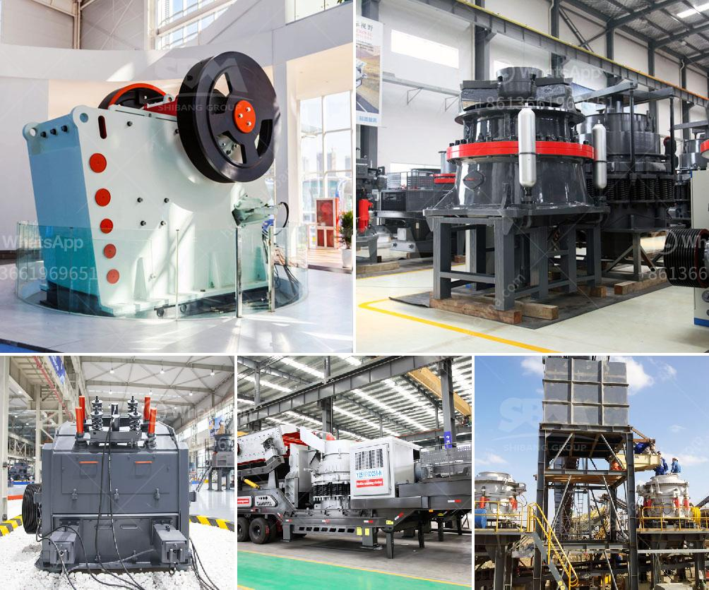

<h3>how much does sand processing plant cost</h3>
Sand is an essential material in various industries, including construction, manufacturing, and landscaping. Its versatility and abundance make it a valuable resource. However, before it can be used in these industries, sand needs to undergo processing at a sand processing plant. The question then arises: how much does a sand processing plant cost?

The cost of a sand processing plant can vary greatly depending on the size, capacity, and specific requirements of the project. Factors such as the location of the plant, the availability of resources, and the level of automation of the plant also impact the cost. However, it is possible to give a general estimate of the cost range for a typical sand processing plant.

A small-scale sand processing plant with a production capacity of 30-50 tons per hour can cost around $10,000 to $40,000. Larger-scale plants with higher production capacities, such as 100-200 tons per hour or more, can cost upwards of $100,000 to several million dollars. It is important to note that these estimates are only rough indicators, and more detailed cost analysis is required for accurate budgeting.

The cost of a sand processing plant includes several components. The first and most significant expense is the equipment needed for the processing operations. This can include crushers, screens, washers, and separators, among other machinery. The cost of equipment depends on factors such as the quality, brand, and size. Additionally, any required auxiliary equipment, such as conveyors or storage facilities, should be considered in the overall cost.

Another major component of the cost is the construction of the plant itself. This includes expenses associated with site preparation, building structures, and installing utilities such as electricity, water, and gas. The construction cost can vary depending on the complexity of the design and the local construction market conditions.

Moreover, the cost of permits and licensing should be factored in. Regulatory requirements differ between jurisdictions, and obtaining the necessary permits can be a time-consuming and costly process. It is crucial to comply with all environmental, health, and safety regulations to ensure the smooth operation of the plant.

Operating costs, including maintenance, labor, and utilities, should also be considered. The energy consumption of the plant, water usage, and the cost of raw materials, such as sand and chemicals for processing, all impact the overall operating expenses.

To further evaluate the economic feasibility of a sand processing plant, it is essential to consider revenue streams. The sale price of the processed sand, the demand in the target market, and the potential customer base all affect the profitability of the project.

In conclusion, the cost of a sand processing plant can vary depending on multiple factors, including size, capacity, location, and specific requirements. Estimating a precise cost without detailed information is challenging, but a rough estimate can range from tens of thousands to millions of dollars. Conducting a comprehensive cost analysis, including equipment, construction, permits, and operating expenses, is crucial for budgeting and determining the economic viability of a sand processing plant project.
<h3>Contact us</h3><ul><li><strong>Whatsapp:&nbsp;<a href="https://wa.me/8613661969651">+8613661969651</a></strong></li><li><a href="https://swt.shibang-china.com/?git&amp;zhl&amp;how much does sand processing plant cost"><strong>Online Service(chat now)</strong></a></li></ul><h3>Related</h3><ul><li><a href='quartz making machine.md'>quartz making machine</a></li><li><a href='mobile stone crushers for sale south africa.md'>mobile stone crushers for sale south africa</a></li><li><a href='pebble crusher for sale.md'>pebble crusher for sale</a></li><li><a href='aggregate washing plant cost.md'>aggregate washing plant cost</a></li><li><a href='conveyor belts for sand for sale.md'>conveyor belts for sand for sale</a></li></ul>