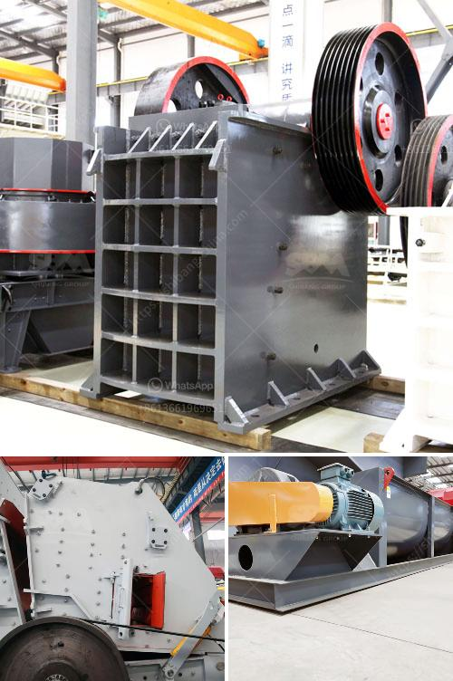

<h3>how much is gold hammer mill crusher</h3>
The gold hammer mill crusher is a type of mill commonly used in large-scale gold mining projects. It is characterized by its high crushing efficiency and versatility. It can break down the hardest rocks into fine powders for further processing.

The gold hammer mill crusher operates by impact action and works in a similar fashion to a conventional hammer mill, using a series of hammer blows to shatter and disintegrate the material being fed into the machine. This crusher type can crush almost any kind of material including gold ore, iron ore, limestone, granite, basalt, copper ore, and coal.

One of the key benefits of the gold hammer mill crusher is its reliable functioning and durability. It is designed to withstand the harsh conditions of a mining environment and can operate continuously for extended periods. This makes it an ideal choice for large-scale gold mining operations where a high volume of ore is processed daily.

The cost of a gold hammer mill crusher can vary widely depending on the manufacturer, model, and supplier. On average, the price range is between $5,000 to $15,000. However, there are more expensive models available for commercial and industrial applications, with prices reaching up to $50,000. These high-end models typically offer superior performance, increased production capacity, and enhanced durability.

In addition to the initial purchase cost, there are other factors to consider when evaluating the overall cost of a gold hammer mill crusher. These include the operating costs, maintenance and repair expenses, and the cost of spare parts. It is important to choose a crusher that offers a good balance between cost and performance, ensuring that it can deliver the desired crushing efficiency without incurring excessive expenses.

When purchasing a gold hammer mill crusher, it is advisable to consider the reputation and track record of the manufacturer or supplier. Look for companies that have been in the industry for a long time and have a proven history of delivering high-quality, reliable machines. Additionally, it is recommended to seek professional advice from experts in the field of mining and crushing equipment to ensure that the chosen crusher meets the specific requirements of the project.

In conclusion, the gold hammer mill crusher is a valuable asset in any gold mining operation. Its high crushing efficiency and versatility make it an essential tool for processing hard rocks and ores. Although the cost of a gold hammer mill crusher can vary, it is important to invest in a reliable, well-built machine that can withstand the demanding conditions of a mining environment. With proper care and maintenance, a gold hammer mill crusher can provide many years of efficient and reliable service, making it a worthwhile investment for any mining operation.
<h3>Contact us</h3><ul><li><strong>Whatsapp:&nbsp;<a href="https://wa.me/8613661969651">+8613661969651</a></strong></li><li><a href="https://swt.shibang-china.com/?git&amp;zhl&amp;how much is gold hammer mill crusher"><strong>Online Service(chat now)</strong></a></li></ul><h3>Related</h3><ul><li><a href='mtw trapezium mill.md'>mtw trapezium mill</a></li><li><a href='saudi arabia used conveyor belts price.md'>saudi arabia used conveyor belts price</a></li><li><a href='stone crushing plant project report.md'>stone crushing plant project report</a></li><li><a href='flowchart of a stone crushing plant.md'>flowchart of a stone crushing plant</a></li><li><a href='jaw crusher for sale ton per hour.md'>jaw crusher for sale ton per hour</a></li></ul>