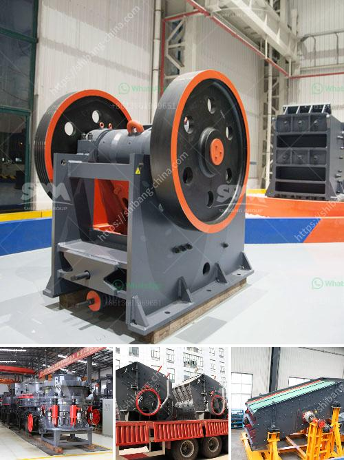

<h3>how much to set up a granite crushing plant</h3>
Setting up a granite crushing plant means carefully analyzing various factors to ensure efficient operation and profitability for your business. Here are some key considerations to keep in mind while planning for a granite crushing plant.

Granite is a highly durable and hard stone that is known for its ability to withstand extreme weather conditions. This makes it ideal for a variety of applications such as construction, road building, and landscaping. With the growing demand for granite aggregates, setting up a granite crushing plant can be a smart investment.

The first step in setting up a granite crushing plant is to assess the material availability. This involves understanding the geological composition and properties of the granite deposit, as well as analyzing the market demand for the specific end product you plan to produce. Conducting a feasibility study can help you determine if there is enough demand and profitability to justify the investment.

Once you have assessed the material availability and market demand, you can estimate the cost of setting up a granite crushing plant. The cost will depend on factors like the size of the plant, the capacity you wish to achieve, and the specific machinery and equipment required. It is essential to obtain quotes from equipment suppliers to get an accurate estimate.

In addition to the cost of the initial setup, you must also consider ongoing expenses such as operational costs, maintenance, and labor. These costs can fluctuate depending on factors such as fuel prices, labor wages, and the frequency of maintenance required. It is crucial to factor in these ongoing expenses when determining the profitability of your granite crushing plant.

Another important consideration is the location of the plant. Ideally, you want a location that is close to the granite quarry to minimize transportation costs. Additionally, ensure that the site is easily accessible for the delivery of raw materials and the shipment of finished products. Consider the availability of water and power supply as these are essential for the operation of the plant.

Furthermore, you need to comply with local regulations and obtain the necessary permits and licenses to operate a crushing plant. These permits might include environmental permits, dust control permits, and noise abatement permits. Failure to comply with these regulations can result in fines and legal complications, so it is crucial to handle all necessary paperwork before starting operations.

Lastly, it is essential to carefully plan the workflow and optimize the plant's design to achieve maximum efficiency. This includes streamlining the material handling process, ensuring proper segregation and sorting of different sizes of granite aggregates, and implementing an effective dust suppression system. By optimizing the plant's design, you can maximize output and minimize downtime, leading to better profitability.

In conclusion, setting up a granite crushing plant requires careful planning and consideration of various factors. By assessing material availability, estimating costs, ensuring compliance with regulations, and optimizing plant design, you can set up a profitable granite crushing plant. Remember to conduct thorough research and seek advice from professionals to make informed decisions and ensure the success of your project.
<h3>Contact us</h3><ul><li><strong>Whatsapp:&nbsp;<a href="https://wa.me/8613661969651">+8613661969651</a></strong></li><li><a href="https://swt.shibang-china.com/?git&amp;zhl&amp;how much to set up a granite crushing plant"><strong>Online Service(chat now)</strong></a></li></ul><h3>Related</h3><ul><li><a href='gold mining equipment manufacturers.md'>gold mining equipment manufacturers</a></li><li><a href='mining ball mill.md'>mining ball mill</a></li><li><a href='grinding machine capacity 1tph stone crusher machine.md'>grinding machine capacity 1tph stone crusher machine</a></li><li><a href='magnetic iron ore processing plant cost.md'>magnetic iron ore processing plant cost</a></li><li><a href='2nd hand crushers thailand.md'>2nd hand crushers thailand</a></li></ul>