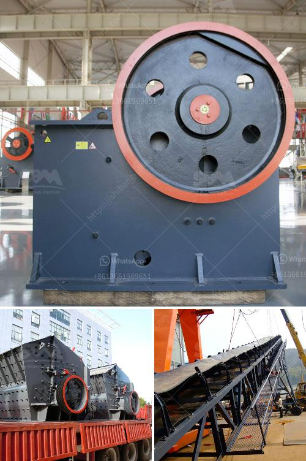

<h3>how stone crusher works</h3>
Stone Crusher falls into a category of heavy-duty machinery that is used for crushing and pulverizing materials ranging from hard stone to soft stone. Stone Crusher is commonly used in mine, melting, building, road, railway, water conservation, and chemical industries. The most commonly used stone crushers are: jaw crusher, impact crusher, pneumatic selective crusher, hammer crusher, impact crusher, roller crusher, and combination more than one.

Firstly, the machine's external structure is strong and made of high-quality materials to reinforce its durability. The frame structure of the stone crusher consists of side plates, front box, back box, and service box.

Secondly, the machine works with cone-shaped mantle and a concave-shaped bowl liner. Both mantle and bowl liner are made of manganese steel for long lasting use. A cone crusher operates like a gyratory crusher, with less steepness in the crushing chamber and more parallel zone between crushing zones.

When the stone enters the crushing chamber, it will be broken into smaller sizes by the force of blow bars and swing hammers. The size of the stone will be reduced, and the subsequent process of crushing begins.

The machine also features a vibrating screen that is used to separate the crushed stones into different sizes. The vibrating screen works on a circular motion, continuously throwing the materials on the screen mesh, and separating them into various sizes based on the customer's requirements.

The crushed stones are then transported to the construction site using a belt conveyor. The belt conveyor system is designed to deliver the stones to the desired location without compromising the quality of the material.

Stone crushers are also equipped with a hydraulic system that regulates the discharge port of the crusher. By controlling the hydraulic system, the operator can quickly adjust the size of the discharge port and get the desired results.

Finally, the stone crusher is powered by a diesel engine or an electric motor. Both engine types are highly efficient and powerful, enabling the machine to crush even the toughest stones.

In conclusion, Stone Crusher is a vital piece of equipment in construction projects. The stone crushing machine ensures that the required product size is achieved and eliminates the need for transporting the material to the other site for further processing. This enables the construction companies to save money on transportation costs while maintaining high-quality standards. Stone Crushers have revolutionized the construction industry and have proved to be essential equipment in modern-day construction projects.
<h3>Contact us</h3><ul><li><strong>Whatsapp:&nbsp;<a href="https://wa.me/8613661969651">+8613661969651</a></strong></li><li><a href="https://swt.shibang-china.com/?git&amp;zhl&amp;how stone crusher works"><strong>Online Service(chat now)</strong></a></li></ul><h3>Related</h3><ul><li><a href='mobile crusher price algerie.md'>mobile crusher price algerie</a></li><li><a href='stone crusher bahan bakar.md'>stone crusher bahan bakar</a></li><li><a href='machinery for manufacturing of artificial granite.md'>machinery for manufacturing of artificial granite</a></li><li><a href='puzzolana crusher plant nairobi kenya.md'>puzzolana crusher plant nairobi kenya</a></li><li><a href='vertical mill mining.md'>vertical mill mining</a></li></ul>