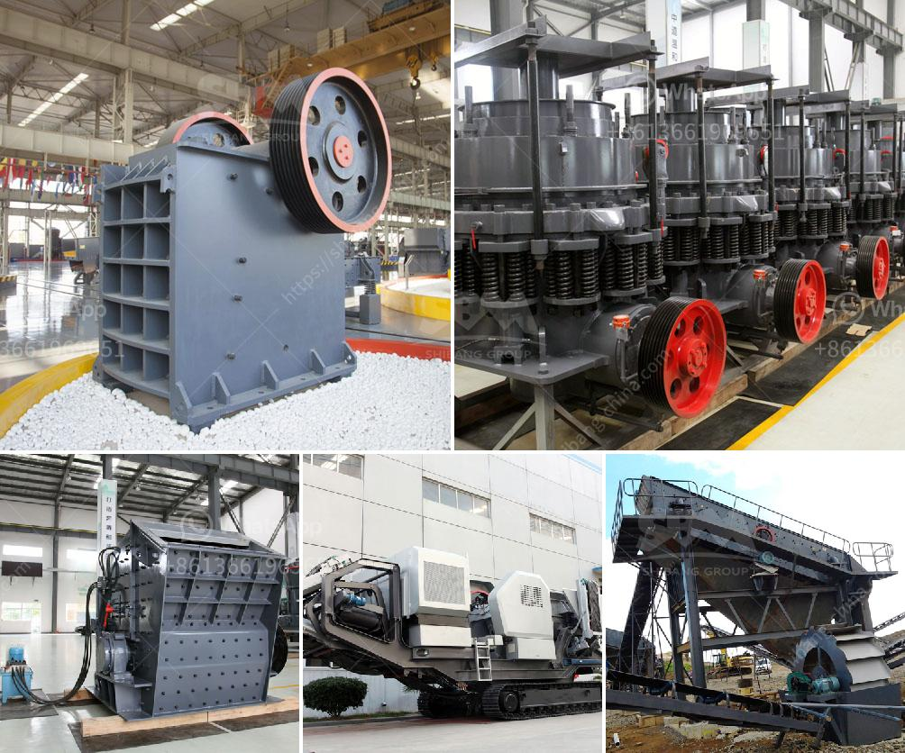

<h3>how to build a concrete crusher</h3>
Building a concrete crusher is not an easy task. However, with some basic knowledge and guidance, anyone can turn concrete rubble into valuable materials that can be reused in construction projects. In this article, we will discuss the steps involved in building a concrete crusher.

Firstly, let's outline the materials and tools required for this project. You will need a sturdy metal frame, a handle, a grinding surface such as railroad tracks or other flat rocks, and some reliable welding equipment.

To begin, start by arranging the metal frame according to the desired size and shape of your crusher. Make sure it is sturdy enough to withstand the force exerted during the crushing process.

Once the frame is ready, weld the handle to one side of the frame. This handle will provide leverage and control when crushing concrete.

Next, prepare the grinding surface by arranging the railroad tracks or flat rocks in a parallel pattern within the frame. Weld them securely to the frame, ensuring they are tightly fitted.

Now, it's time to test your concrete crusher. Start by collecting concrete rubble that you want to crush. Place the rubble in the center of the grinding surface and apply force using the handle. Be cautious during this step, as excessive force can damage the crusher or injure yourself.

Continue crushing the concrete until you have broken it down into small, manageable pieces. These pieces can then be used as structural fill, base material, or recycled to create new concrete.

Remember to regularly maintain your concrete crusher to ensure its effectiveness. Clean any debris stuck within the crusher and check for any loose parts that need tightening.

Building a concrete crusher can be a challenging but rewarding project. By repurposing concrete rubble, you not only save money but also contribute to environmental sustainability. So roll up your sleeves, gather the necessary materials, and start building your very own concrete crusher.
<h3>Contact us</h3><ul><li><strong>Whatsapp:&nbsp;<a href="https://wa.me/8613661969651">+8613661969651</a></strong></li><li><a href="https://swt.shibang-china.com/?git&amp;zhl&amp;how to build a concrete crusher"><strong>Online Service(chat now)</strong></a></li></ul><h3>Related</h3><ul><li><a href='portable quarry crushers for sale in the usa.md'>portable quarry crushers for sale in the usa</a></li><li><a href='crusher machine suppliers.md'>crusher machine suppliers</a></li><li><a href='cost of clinker grinding and cemen packing plant.md'>cost of clinker grinding and cemen packing plant</a></li><li><a href='best portable jaw crusher granite.md'>best portable jaw crusher granite</a></li><li><a href='raymond pulverizer mill pdf.md'>raymond pulverizer mill pdf</a></li></ul>