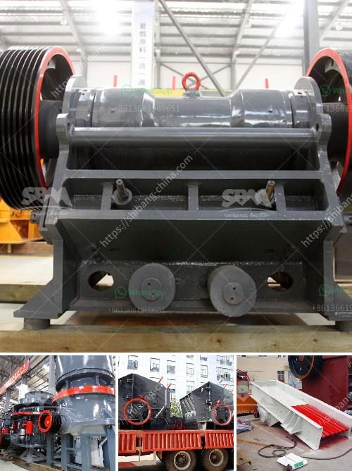

<h3>how to calcium plant manufacturer</h3>
Calcium is an essential nutrient for plants, playing a vital role in various physiological processes such as cell division, cell elongation, and nutrient uptake. While most plants receive sufficient calcium from the soil, certain soil conditions may lead to calcium deficiency, resulting in stunted growth, distortion, and even plant diseases. In such cases, a calcium plant manufacturer can be a valuable resource to supplement the plant's calcium requirements.

To source a reliable calcium plant manufacturer, start by researching reputable companies in the industry. Look for manufacturers that specialize in producing high-quality calcium products specifically formulated for plants. Check their product range to ensure they offer a variety of calcium solutions suitable for different plant species and growth stages.

Next, evaluate the manufacturer's production process. Ensure that they follow stringent quality control measures and adhere to industry standards. A manufacturer that conducts regular tests and certifications on their products will provide assurance of their reliability and efficacy.

Consider the manufacturer's reputation within the farming and gardening community. Look for feedback and reviews from other customers regarding their experience with the manufacturer's products. Positive testimonials from satisfied customers can indicate the manufacturer's commitment to quality and customer satisfaction.

Furthermore, transparency in labeling and packaging is crucial. The manufacturer should provide clear instructions on the product's application and dosage. It is also beneficial to find a manufacturer that offers support and guidance to farmers and gardeners, such as providing advice on how to best incorporate calcium supplements into their plant care routine.

Lastly, consider the manufacturer's commitment to sustainability and environmentally friendly practices. Opt for a manufacturer that prioritizes sustainable sourcing of raw materials and employs eco-friendly manufacturing processes.

In conclusion, finding a reliable calcium plant manufacturer is essential to provide plants with the necessary calcium supplementation, especially in cases of deficient soil conditions. By conducting thorough research, evaluating production processes, considering reputation and customer feedback, and prioritizing sustainability, one can successfully source a reputable manufacturer to meet their plant's calcium needs.
<h3>Contact us</h3><ul><li><strong>Whatsapp:&nbsp;<a href="https://wa.me/8613661969651">+8613661969651</a></strong></li><li><a href="https://swt.shibang-china.com/?git&amp;zhl&amp;how to calcium plant manufacturer"><strong>Online Service(chat now)</strong></a></li></ul><h3>Related</h3><ul><li><a href='gold refinery equipment china.md'>gold refinery equipment china</a></li><li><a href='conveyor belts for dies.md'>conveyor belts for dies</a></li><li><a href='process of setting of a stone crusher in orissa.md'>process of setting of a stone crusher in orissa</a></li><li><a href='rock salt mining open pit feasibility study.md'>rock salt mining open pit feasibility study</a></li><li><a href='stone crushing plant th hard rock.md'>stone crushing plant th hard rock</a></li></ul>