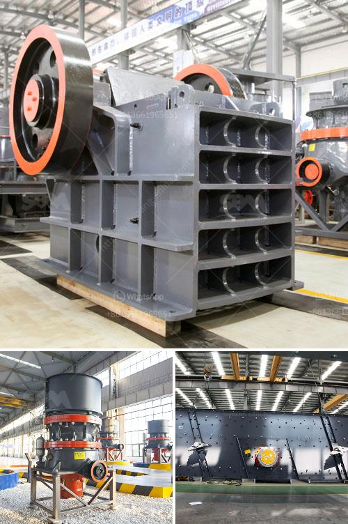

<h3>how to calculate coal mill capacity for cement plant</h3>
Calculating coal mill capacity for a cement plant can be performed in several ways, but one method that is commonly used is the roller press. In this article, we will discuss the process of calculating coal mill capacity for a cement plant.

Coal mill is an important component of the thermal power plant. It is used to grind and dry the coal particles before they are fed to the burner. The coal is pulverized in the mill and then fed into the kiln for combustion.

To calculate coal mill capacity for a cement plant, the first step is to measure the coal flow rate into the mill. This is measured by the coal feeder device, which continuously measures and controls the coal flow rate to the mill.

Once the coal flow rate is measured, it is multiplied by the coal density to determine the total mass of coal entering the mill per unit of time. The coal density can be obtained from the coal supplier or from laboratory tests.

Next, the mill capacity needs to be determined. The mill capacity is defined as the maximum amount of coal that can be milled and dried in the mill during a given period. This is usually expressed as a percentage of the total mill capacity.

To calculate the mill capacity, various factors such as the coal properties (Hardgrove grindability index, HGI), the moisture content, and the coal fineness need to be taken into account.

The HGI is a measure of the coal's grindability, or how easily it can be ground. The higher the HGI, the easier it is to grind the coal. The moisture content of the coal affects its grindability as well, with higher moisture content making the coal more difficult to grind.

The coal fineness refers to the particle size distribution of the coal particles after grinding. It is measured by the percentage of coal particles passing through a specific sieve size. The desired coal fineness is usually specified by the cement plant.

Mill Capacity = (Mass of coal entering the mill per unit of time) / (Coal density x HGI x (1 - Moisture content) x (Coal fineness/Percentage of coal particles passing through sieve size))

By plugging in the appropriate values for the coal density, HGI, moisture content, and coal fineness, the mill capacity can be calculated.

It is important to note that these calculations provide an estimate of the mill capacity. The actual mill capacity can vary depending on various factors such as the coal quality, the mill condition, and the operating conditions of the coal mill.

In conclusion, calculating coal mill capacity for a cement plant involves measuring the coal flow rate into the mill, determining the coal density, and considering factors such as the coal properties, moisture content, and coal fineness. By utilizing these calculations, the mill capacity can be estimated and optimized for efficient operation.
<h3>Contact us</h3><ul><li><strong>Whatsapp:&nbsp;<a href="https://wa.me/8613661969651">+8613661969651</a></strong></li><li><a href="https://swt.shibang-china.com/?git&amp;zhl&amp;how to calculate coal mill capacity for cement plant"><strong>Online Service(chat now)</strong></a></li></ul><h3>Related</h3><ul><li><a href='magnetic iron ore processing plant cost.md'>magnetic iron ore processing plant cost</a></li><li><a href='business plan for coal processing.md'>business plan for coal processing</a></li><li><a href='shafts for hammer mills.md'>shafts for hammer mills</a></li><li><a href='silica sand washing purification.md'>silica sand washing purification</a></li><li><a href='kenya jaw crusher for sale.md'>kenya jaw crusher for sale</a></li></ul>