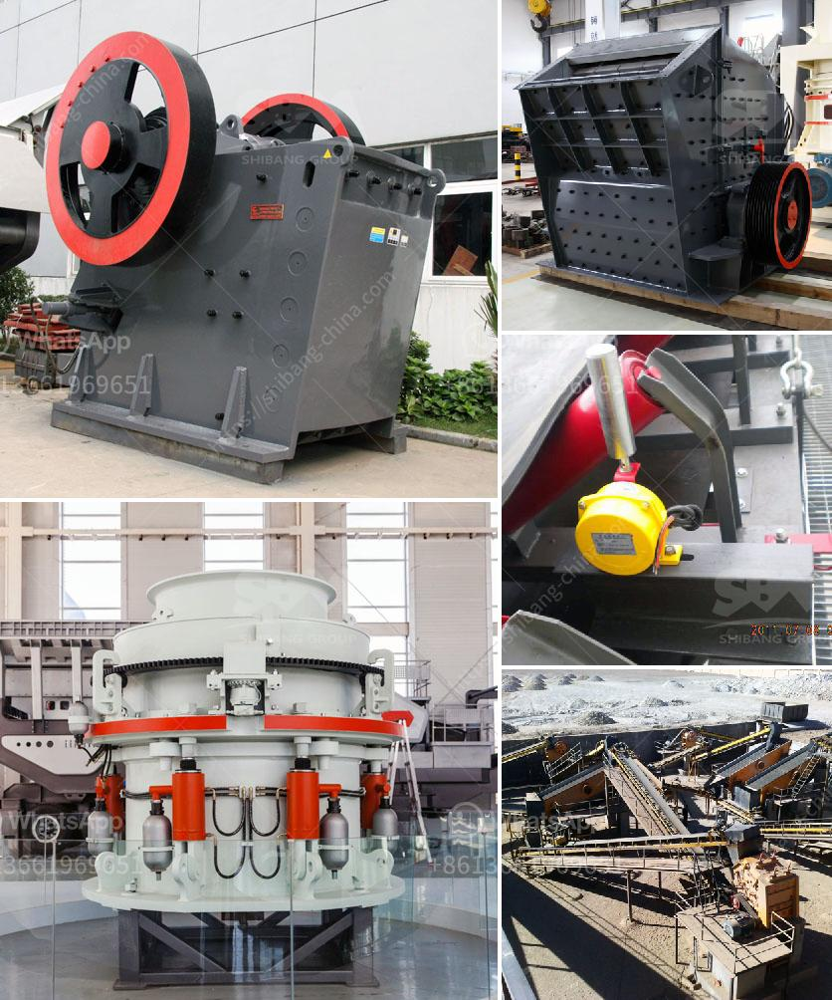

<h3>how to calculate crushing plant efficency</h3>
Calculating the efficiency of a crushing plant is a crucial factor in maximizing productivity. To determine the efficiency level of a plant, it requires analyzing the entire process, from the feeding stage to the final product. By employing proper techniques, operators can quantify the efficiency accurately and make data-driven decisions to enhance plant performance.

The first step in calculating crushing plant efficiency is to measure the feed size distribution, as this will provide valuable information about the required crushing stages and equipment. It is crucial to obtain a consistent feed size, ensuring that all material is within the optimal range for the desired end product.

Another important factor to consider is the closed-side setting (CSS) of the crusher. By adjusting the CSS, operators can control the size of the product and optimize the crushing efficiency. Setting it too tight may result in excessive wear, while setting it too loose may produce oversize material. Continuous monitoring and adjusting CSS based on the desired product size are essential for achieving high efficiency.

Additionally, operators should measure the time it takes for the material to pass through the crusher. This is known as the residence time. Long residence times indicate inefficient crushing, while short residence times may result in inadequate crushing. Optimizing the residence time ensures that the material is adequately crushed, leading to improved efficiency.

Lastly, monitoring the production rate is essential for calculating crushing plant efficiency. Comparing the output to the input (the feed rate) will determine how effectively the plant converts raw material into the final product. Tracking the production rate allows operators to identify bottlenecks or inefficiencies within the crushing process and make necessary adjustments.

To summarize, calculating the efficiency of a crushing plant requires measuring the feed size distribution, adjusting the closed-side setting, monitoring residence time, and tracking the production rate. By optimizing these factors, operators can determine the efficiency accurately and efficiently enhance plant performance. Continuous monitoring, analysis, and improvement are key to maintaining a high level of efficiency and productivity in crushing plants.
<h3>Contact us</h3><ul><li><strong>Whatsapp:&nbsp;<a href="https://wa.me/8613661969651">+8613661969651</a></strong></li><li><a href="https://swt.shibang-china.com/?git&amp;zhl&amp;how to calculate crushing plant efficency"><strong>Online Service(chat now)</strong></a></li></ul><h3>Related</h3><ul><li><a href='feldspar grinding plant.md'>feldspar grinding plant</a></li><li><a href='sayaji stone crushers ahmedabad.md'>sayaji stone crushers ahmedabad</a></li><li><a href='quartz stone pulverizer.md'>quartz stone pulverizer</a></li><li><a href='mobile coal crusher price sa.md'>mobile coal crusher price sa</a></li><li><a href='start up granite quarry business.md'>start up granite quarry business</a></li></ul>