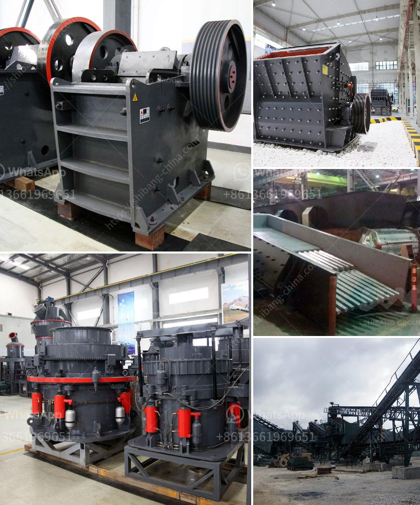

<h3>how to calculate the operating cost of a stone crusher</h3>
Calculating the operating cost of a stone crusher is not as straightforward as it may seem. The actual costs of operating a stone crusher can vary depending on several factors, such as the type of stone crusher, the size of the stone, and the location of the project.

1. Choose the right type of stone crusher: The choice of stone crusher depends on the type and amount of material to be crushed. Gyratory and jaw crushers are popular primary crushers used to process large stones. Cone crushers and impact crushers are commonly used for secondary crushing.

2. Estimate the size and capacity needed: The size and capacity of a stone crusher determine its performance and cost-effectiveness. Consider the following factors when selecting a stone crusher:

3. Calculate the production capacity: The production capacity of a stone crusher is generally expressed in tons per hour. This calculation should consider the loading, transportation, and other factors that may affect the stone crusher's capacity.

4. Estimate the energy consumption: The energy consumption of a stone crusher directly affects its operational cost. The energy consumed depends on various factors, including the type and quality of the input material, the size and design of the crusher, the required reduction ratio, and the operational settings.

5. Evaluate the maintenance requirements: Stone crushers operate in harsh environments, and regular maintenance is crucial for their optimal performance and longevity. Consider the cost of routine maintenance, as well as the potential for unplanned repairs and downtime.

6. Assess the wear parts costs: Stone crushers require regular replacement of wear parts such as liners, jaws, cones, and rotor components. The cost of wear parts should be factored into the overall operational cost, as these components may need to be replaced frequently, particularly in high-impact applications.

7. Consider the transportation costs: The location of the stone crusher can significantly impact the operating cost due to transportation expenses. Ensure that the stone crusher is situated close to the quarry or construction site to minimize transportation costs.

8. Determine the financing and depreciation costs: When calculating the operating cost of a stone crusher, it is essential to consider the capital investment required, financing options, and the expected lifespan of the equipment. Based on these factors, you can estimate the depreciation cost over time.

In conclusion, estimating the operating cost of a stone crusher requires a combination of factors and calculations. By considering the type of stone crusher, production capacity, energy consumption, maintenance requirements, wear parts costs, transportation expenses, and financing options, you can arrive at an accurate estimate of the operational cost. Remember to consider all aspects before making an informed decision to ensure the stone crusher aligns with your budget and project needs.
<h3>Contact us</h3><ul><li><strong>Whatsapp:&nbsp;<a href="https://wa.me/8613661969651">+8613661969651</a></strong></li><li><a href="https://swt.shibang-china.com/?git&amp;zhl&amp;how to calculate the operating cost of a stone crusher"><strong>Online Service(chat now)</strong></a></li></ul><h3>Related</h3><ul><li><a href='spare parts cone crushers telesmit cone.md'>spare parts cone crushers telesmit cone</a></li><li><a href='small stone crusher machine in italy.md'>small stone crusher machine in italy</a></li><li><a href='stone mill hammer mill.md'>stone mill hammer mill</a></li><li><a href='grinding machine manufacturers ethiopia.md'>grinding machine manufacturers ethiopia</a></li><li><a href='vrm vertical roller mill.md'>vrm vertical roller mill</a></li></ul>