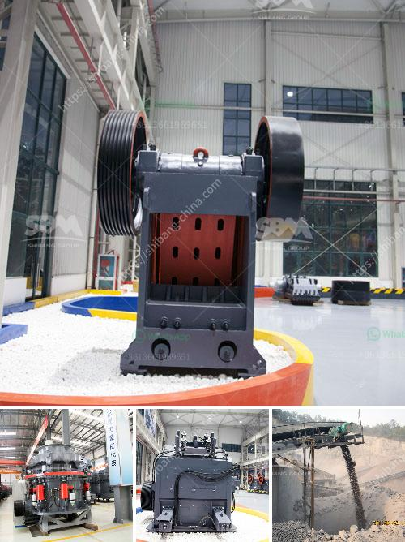

<h3>how to design stone crusher building</h3>
When it comes to building a structure, one of the most important factors to consider is the stone crusher. A stone crusher is a machine designed to reduce large rocks into smaller rocks, gravel, or rock dust. Crushers can be used to reduce the size or shape of stones and waste materials, so it can be easily disposed of or recycled, or used for various other purposes. 

A stone crusher is an indispensable equipment for the construction industry. It can be used for producing concrete, asphalt, and other building materials. The crushing ratio of the stone crusher is defined as the ratio of the particle size of the input to the output. It is the ratio of the particle size of the broken product and the particle size of the feed material. The crushing ratio affects the production efficiency and energy consumption of the stone crusher. Therefore, it is important to design the stone crusher with a reasonable crushing ratio. 

Firstly, it is crucial to determine the requirements of the project. This includes considering the type and size of stones that need to be processed. For example, if the project requires the production of small stones for road construction, a jaw crusher would be more suitable. On the other hand, if the project requires producing larger stones for building foundations, a cone crusher should be considered. 

Secondly, the design of the stone crusher should take into account the moisture content of the raw materials. If the moisture content is too high, it may cause the materials to stick together and reduce the efficiency of the crusher. Therefore, it is important to choose a crusher that can handle wet materials or consider installing a dryer in the crushing process.

Another important factor to consider is the hardness of the stones. The hardness of the stones will affect the type of crusher required and the wear resistance of the crusher's parts. For example, if the stones are extremely hard, a impact crusher or a gyratory crusher should be considered. These crushers are designed to handle high compressive strength and abrasive materials. Conversely, if the stones are relatively soft, a jaw crusher or a cone crusher may be more suitable. 

Additionally, the design of the stone crusher building should also consider the noise and dust pollution. Measures such as enclosing the crushing area and using dust suppression systems can help mitigate these issues. Moreover, proper maintenance and regular inspections of the crusher can also contribute to reducing noise and dust pollution.

In conclusion, designing a stone crusher building requires careful consideration of various factors such as the type and size of stones, moisture content, hardness, and environmental impacts. By taking these factors into account, a well-designed stone crusher building can contribute to efficient and sustainable construction practices.
<h3>Contact us</h3><ul><li><strong>Whatsapp:&nbsp;<a href="https://wa.me/8613661969651">+8613661969651</a></strong></li><li><a href="https://swt.shibang-china.com/?git&amp;zhl&amp;how to design stone crusher building"><strong>Online Service(chat now)</strong></a></li></ul><h3>Related</h3><ul><li><a href='used raymond mills barite raymond mill.md'>used raymond mills barite raymond mill</a></li><li><a href='stone crusher south africa.md'>stone crusher south africa</a></li><li><a href='jaw crusher and cone crusher manufacturers in dubai.md'>jaw crusher and cone crusher manufacturers in dubai</a></li><li><a href='grinding machine for gypsum powder.md'>grinding machine for gypsum powder</a></li><li><a href='nigeria vertical mill machine.md'>nigeria vertical mill machine</a></li></ul>