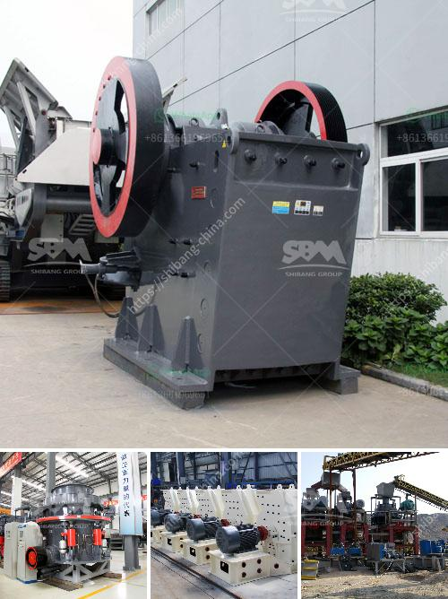

<h3>how to dismantle brand jaw crusher</h3>
Jaw crushers are used in various industries to efficiently crush hard materials, including rocks, concrete, and asphalt. In a jaw crusher, a moving jaw attached to an eccentric shaft compresses the material against a stationary jaw and reduces it to smaller sizes. In this article, we'll explore the steps required to dismantle a brand jaw crusher and how it can be safely and effectively done.

Before starting any maintenance or dismantling process, it is crucial to disconnect the power supply. This step is vital to ensure both your safety and the protection of the jaw crusher. Check the electrical isolation switch and make sure it is in the "off" position. Also, ensure that any other relevant power sources, such as generators, are switched off or disconnected.

Create a safe working environment by removing any unnecessary objects or debris from the area around the jaw crusher. Gather all the required tools, including wrenches, sockets, hydraulic jack, impact driver, and others, to aid in the dismantling process. It's important to have the right tools handy, as it will facilitate a smooth dismantling process.

To ensure stability and prevent any accidental movement, place sturdy supports, such as wooden blocks or hydraulic jacks, beneath the jaw crusher. This will provide additional stability during the dismantling process and reduce the risk of injuries.

Start by disconnecting the electric motor from the drive belts and pulleys. Use the appropriate tools to loosen the tension on the belts and carefully remove them from the pulleys. It may be necessary to refer to the manufacturer's manual to identify the correct procedure for belt removal if specific instructions are not readily available.

The jaw crusher may have a hydraulic system that needs to be disconnected. Depending on the crusher model, there could be multiple hydraulic cylinders or rams. Follow the manufacturer's instructions to disconnect the hydraulic lines from the cylinders and relieve any pressure from the system before proceeding.

To dismantle the swing jaw from the crusher unit, remove the fasteners securing the cheek plates and the stationary jaw die. Undo the retaining nuts, and release the tension rod assembly carefully. The swing jaw will now slide out easily from the crusher unit.

Before removing the toggle plate, it is essential to relieve any tension in the spring holding it in place. This can be achieved by loosening the tension rod nut near the toggle plate. Once the tension is released, remove the retaining nuts and bolts that secure the toggle plate. Carefully lift the toggle plate off the unit.

Dismantling a brand jaw crusher may seem like a challenging task, but by following the correct steps and safety measures, it can be done efficiently. Remember, safety is paramount, and that includes disconnecting the power source and working in a well-prepared environment. By adhering to the manufacturer's guidelines and using the right tools, you can safely and successfully dismantle a jaw crusher.
<h3>Contact us</h3><ul><li><strong>Whatsapp:&nbsp;<a href="https://wa.me/8613661969651">+8613661969651</a></strong></li><li><a href="https://swt.shibang-china.com/?git&amp;zhl&amp;how to dismantle brand jaw crusher"><strong>Online Service(chat now)</strong></a></li></ul><h3>Related</h3><ul><li><a href='lime mining crusher in india.md'>lime mining crusher in india</a></li><li><a href='4 roller mill for stone.md'>4 roller mill for stone</a></li><li><a href='stone crusher mills in mercadolibre.md'>stone crusher mills in mercadolibre</a></li><li><a href='hot used trommel screen machine in sand.md'>hot used trommel screen machine in sand</a></li><li><a href='desain conveyor belt di tambang batu bara.md'>desain conveyor belt di tambang batu bara</a></li></ul>