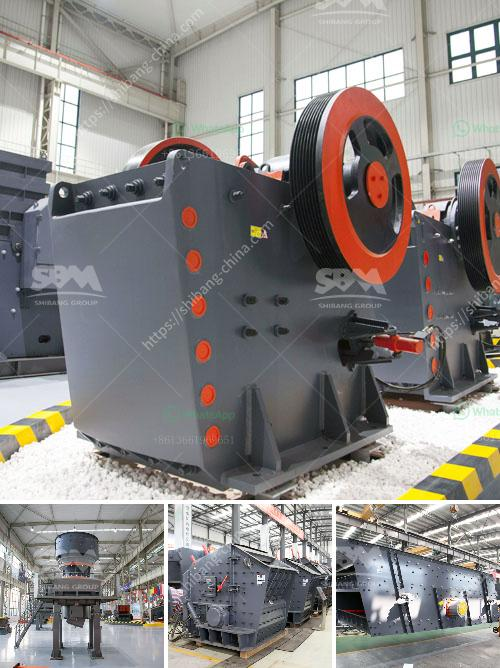

<h3>how to make a stone crushing plant</h3>
A stone crushing plant is primarily involved in the manufacture of aggregates of various sizes (coarse aggregates, crusher run, rock sand, and other fine aggregates) from basalt boulders. Coarse aggregates are usually used in ready mix concrete and asphaltic concrete. Crusher run is used for the bases and sub-bases for road making.

Fine aggregates are used for the production of concrete and plastering. The processes involved in stone crushing include preprocessing, crushing, washing, screening, and recycling of wastewater.

Preprocessing consists of removing stone boulders by mechanical means and feeding large stones into primary crushers to reduce them to smaller sizes. The primary crusher produces a product that is gauged by the size of the open side of the mantle.

Crushing is the initial stage in the stone crushing process. Crushing plants consist of various crushers, feeders, screens, and conveyors. Primary crushers reduce large rock fragments into smaller sizes that are suitable for transport over long distances and for the production of concrete and asphalt.

Secondary crushers are used to further reduce smaller sizes of crushed rock. During the crushing process, screens are used to separate the crushed stones into different sizes. Belt conveyors are used to convey the material between the crushers. Feeders are used to deliver the material to the crusher in a controlled manner.

Washing is the process of cleaning the crushed materials to remove impurities such as clay and silt. The resulting clean material is then stockpiled using belt conveyors.

Screening is the process of separating the crushed stone into different sizes using screens. Different size aggregates are produced during this process.

The wastewaters generated during the stone crushing process contain suspended solids, sediments, and pollutants. These wastewaters are treated before they are discharged into the environment. A wastewater treatment plant is used to treat the wastewaters and recycle them for further use in the production process.

To set up a stone crushing plant, a substantial amount of capital is required, which can be borrowed from a bank or obtained from investors. A main machinery for the plant would include a primary crusher, secondary crusher, vibrating screens, belt conveyors, washing plant, and wastewater treatment plant.

The entire operation requires significant manpower and expertise. The crushing plant operator must monitor the operation of the machines and ensure smooth operations. Additionally, maintenance and repairs of the machinery are also crucial to ensure the efficiency and longevity of the plant.

In conclusion, a stone crushing plant is primarily involved in the manufacture of aggregates of various sizes. The proposed plant includes various machinery such as primary crushers, secondary crushers, vibrating screens, belt conveyors, and washing plants. These machines are used to produce concrete, asphalt, and road bases, among others. It is important to ensure consistent and efficient operations of the plant, along with proper maintenance and wastewater treatment to minimize environmental impacts.
<h3>Contact us</h3><ul><li><strong>Whatsapp:&nbsp;<a href="https://wa.me/8613661969651">+8613661969651</a></strong></li><li><a href="https://swt.shibang-china.com/?git&amp;zhl&amp;how to make a stone crushing plant"><strong>Online Service(chat now)</strong></a></li></ul><h3>Related</h3><ul><li><a href='crusher jaw crusher 6x8 jaw.md'>crusher jaw crusher 6x8 jaw</a></li><li><a href='manufacturing process of cement.md'>manufacturing process of cement</a></li><li><a href='gypsum machine price.md'>gypsum machine price</a></li><li><a href='cement vertical roller mill.md'>cement vertical roller mill</a></li><li><a href='stone crusher machine of 150 tonnes price.md'>stone crusher machine of 150 tonnes price</a></li></ul>