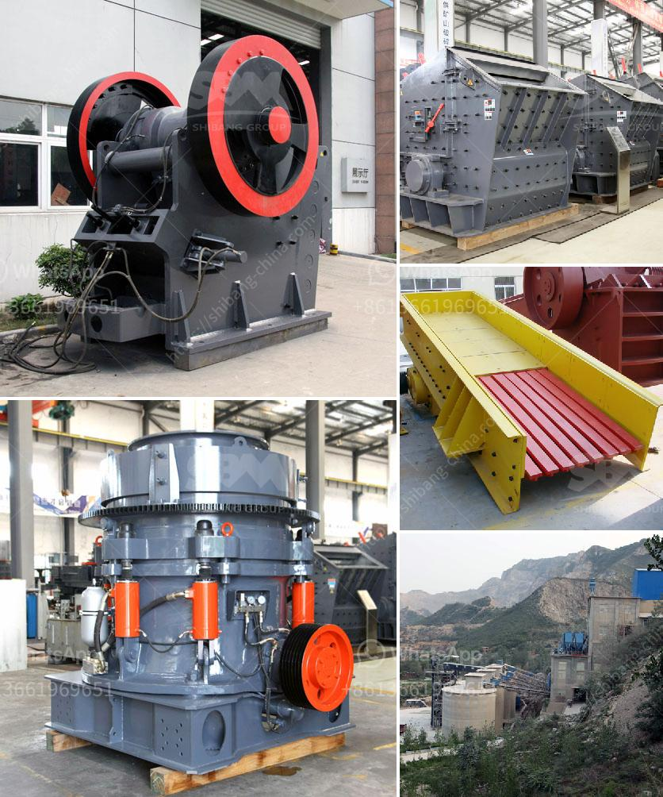

<h3>how to make clay from powder clay</h3>
Clay is a versatile and widely-used material in crafts and sculpting. Whether you need clay for pottery, jewelry making, or other artistic endeavors, making your own clay from powder clay is a cost-effective and easy alternative. It allows you to have complete control over the consistency and color of the clay, tailoring it to your specific needs. In this article, we will guide you through the step-by-step process of making clay from powder clay.

Start by measuring the desired amount of powder clay using a measuring cup. The amount will depend on your project's size, but a good starting point is two cups of powder clay.

Gradually add water to the powder clay while stirring it with a spoon or spatula. Start with small quantities of water and continue adding more until you achieve the desired consistency. Be careful not to add too much water at once; otherwise, your clay might become too sticky or runny.

Mix the powder clay and water thoroughly until they combine into a sticky, dough-like substance. Once the initial mixing is complete, transfer the mixture onto a clean surface or kneading board to further work the clay. Knead it with your hands, applying pressure and folding it repeatedly, until it becomes consistent and pliable. This process will help distribute the moisture evenly and remove any remaining lumps or dry spots.

If your clay is too dry, add a few drops of water and knead it again. On the other hand, if it's too wet, sprinkle some more powder clay over the surface and knead it until the desired consistency is achieved. You can also add color to your clay at this stage by blending in powdered pigments, acrylic paints, or food coloring. Continuously knead and fold the clay until the color is evenly distributed.

Once you are satisfied with the consistency and color of your clay, it is important to store it properly to keep it from drying out. Wrap it tightly in plastic wrap or place it in an airtight container to prevent air exposure. This will maintain the clay's moisture and make it usable for an extended period.

Making your own clay from powder clay not only allows you to save money, but it also grants you greater control over the clay's qualities. By adjusting the amount of water and powder clay, you can create a clay with the perfect consistency for your specific project. Remember to experiment and have fun with different colors and textures, and don't be afraid to add your personal touch to your creations.

So next time you embark on a creative project, consider making your own clay from powder clay. You'll be amazed at how easy and rewarding the process can be, and the satisfaction of working with self-made clay will add a unique touch to your art!
<h3>Contact us</h3><ul><li><strong>Whatsapp:&nbsp;<a href="https://wa.me/8613661969651">+8613661969651</a></strong></li><li><a href="https://swt.shibang-china.com/?git&amp;zhl&amp;how to make clay from powder clay"><strong>Online Service(chat now)</strong></a></li></ul><h3>Related</h3><ul><li><a href='spare parts cone crushers telesmit cone.md'>spare parts cone crushers telesmit cone</a></li><li><a href='dicalcium phosphate process hydrochloric acid flow chart.md'>dicalcium phosphate process hydrochloric acid flow chart</a></li><li><a href='iron ore crushing and screening.md'>iron ore crushing and screening</a></li><li><a href='mining companies that sell heavy equipment.md'>mining companies that sell heavy equipment</a></li><li><a href='kaolin crusher processing plant.md'>kaolin crusher processing plant</a></li></ul>