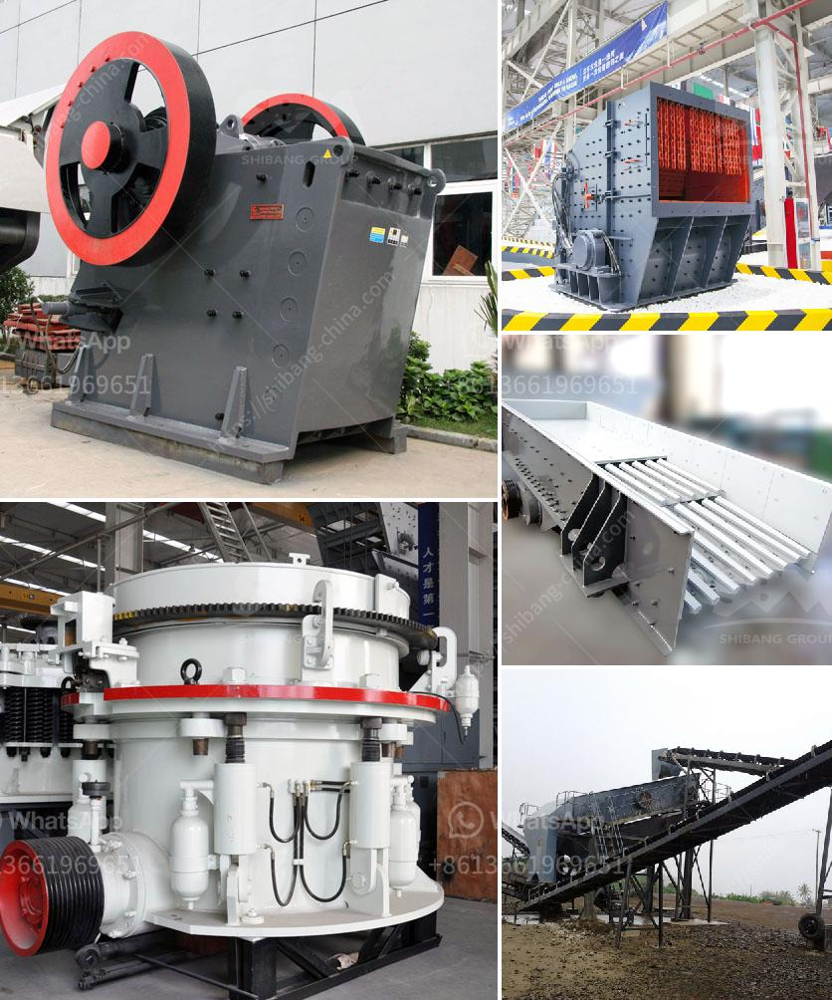

<h3>how to make unq stone crusher</h3>
A stone crusher is a machine used to convert large stones into smaller sizes that can be used in construction or other purposes. There are several types of stone crushing machines, which are differentiated based on the stone processing stages, namely primary crusher, secondary crusher, and tertiary crusher. Each type of stone crusher has its unique features and functions. However, if you are looking to create a homemade stone crusher, you can customize it to suit your specific needs. In this article, we will provide step-by-step instructions on how to make a unique stone crusher.

Before you start assembling the stone crusher, it is important to design it according to your requirements. Determine the overall size, shape, and layout of the stone crusher. Take into consideration factors such as the available space, the stones' size and hardness, and the desired output size. Sketch your design on paper and note down the dimensions for later reference.

Using a grinder or saw, cut the metal plate or board according to the specifications of your design. Ensure that it is sturdy enough to withstand the crushing process. If necessary, you can reinforce the plate or board with additional metal bars or supports.

Place the metal plate or board on a firm and stable surface. Start attaching the metal bars or supports to the plate using nails or screws. Ensure that they are securely fastened to prevent any accidents during operation. Create a frame that fits the dimensions of your design, leaving enough space for the stones to be fed into the crusher.

The hammer is the main component of the stone crusher as it is responsible for delivering the crushing force to the stones. Drill a hole through one end of the hammer and secure it with a strong metal pin or rod. Place the hammer in a vertical position and attach it to the crusher frame using welds or bolts. Make sure it is securely in place and aligned properly to ensure optimal crushing performance.

Once the stone crusher is fully assembled, it is crucial to test its functionality before using it for actual stone crushing. Put on safety goggles and gloves to protect yourself during this process. Insert different sizes of stones into the crusher's opening and observe how well it crushes them. Make any necessary adjustments to improve its performance, such as adjusting the hammer's position or increasing the crushing force.

Remember that safety should always be your top priority when constructing or operating a stone crusher. Wear appropriate safety equipment, work in a well-ventilated area, and follow all relevant safety guidelines and regulations.

In conclusion, creating a unique stone crusher involves designing a suitable layout, preparing the materials, assembling the components, and testing its functionality. With the right tools and careful planning, you can build a homemade stone crusher to effectively crush stones according to your specific needs.
<h3>Contact us</h3><ul><li><strong>Whatsapp:&nbsp;<a href="https://wa.me/8613661969651">+8613661969651</a></strong></li><li><a href="https://swt.shibang-china.com/?git&amp;zhl&amp;how to make unq stone crusher"><strong>Online Service(chat now)</strong></a></li></ul><h3>Related</h3><ul><li><a href='crushing and screening plant.md'>crushing and screening plant</a></li><li><a href='models of ball mills.md'>models of ball mills</a></li><li><a href='crusher machine suppliers.md'>crusher machine suppliers</a></li><li><a href='raymond mill india.md'>raymond mill india</a></li><li><a href='used stone crusher equipment price uk.md'>used stone crusher equipment price uk</a></li></ul>