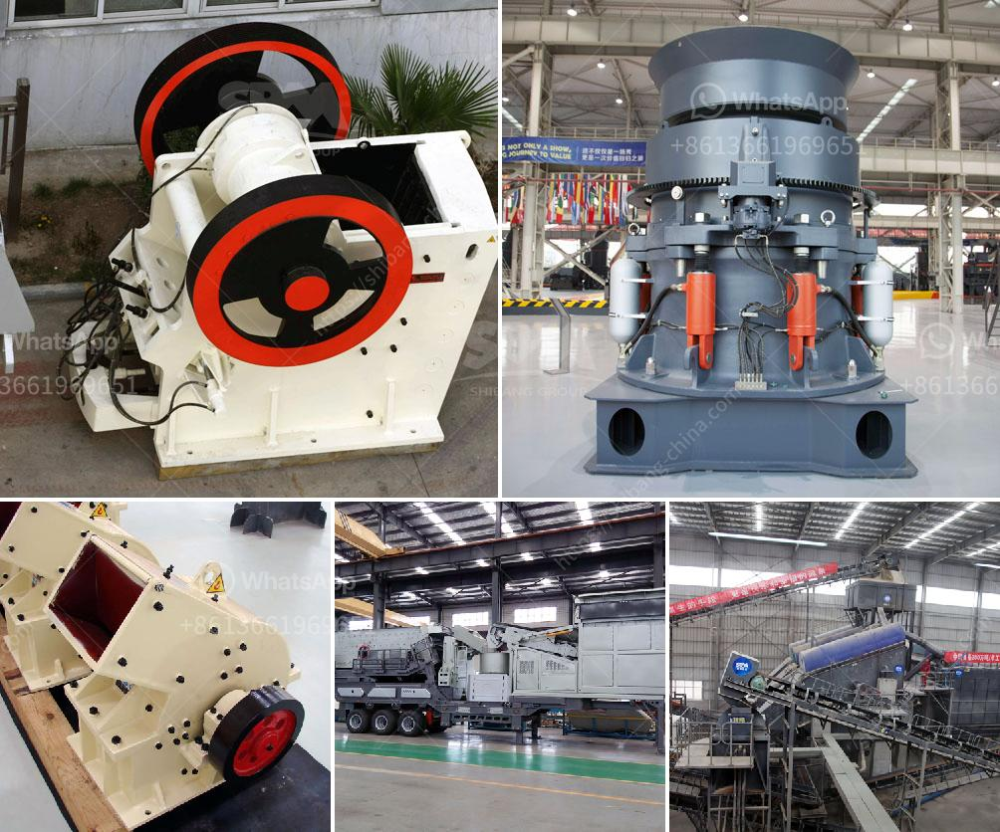

<h3>how to process quartz ore crusher</h3>
Quartz is a widely abundant mineral found in many different geological settings. It can be found in igneous, metamorphic, and sedimentary rocks. Although it has various industrial uses, one of the most common applications is in the construction industry, where quartz is crushed to produce sand and gravel. Processing quartz ore crusher involves several steps to produce a usable end product. In this article, we will explore the process of crushing quartz ore and highlight the key steps involved.

Before the quartz ore can be processed, it needs to be extracted from the ground. Large machinery such as excavators, bulldozers, and trucks are used to remove the overburden and expose the quartz ore beneath. Care must be taken during this process to ensure the integrity of the quartz ore, as any contamination from the surrounding rocks can affect the quality of the final product.

Once the quartz ore has been extracted, it is delivered to the crushing plant for further processing. The crushing stage is the initial step in the reduction of quartz ore to a size suitable for direct application or further processing. Primary crushers, such as jaw crushers or gyratory crushers, are typically used to achieve the desired size reduction. The choice of crusher depends on the characteristics of the quartz ore and the desired end product.

After the initial crushing stage, the quartz ore is screened to separate it into different sizes. This step is crucial in achieving the desired product quality and uniformity. Vibrating screens or trommel screens are commonly used for this purpose. The quartz ore is then sorted into different grades based on its size and quality. This allows for better control and utilization of the quartz ore during subsequent processing steps.

In some cases, further size reduction is required to achieve the desired product specifications. This is achieved through grinding and classification. Grinding mills such as ball mills or vertical roller mills are used to finely grind the quartz ore to a desired particle size. Classification techniques, such as hydrocyclones or air classifiers, are then used to separate the ground quartz ore into different size fractions.

Depending on the desired end product, additional processing steps may be required. For example, to produce high-purity quartz sand, flotation is often used to remove impurities through selective separation. Alternatively, magnetic separation can be employed to remove iron-bearing minerals from the quartz ore. These additional steps enhance the purity and quality of the final product.

In conclusion, processing quartz ore crusher involves a series of steps to extract and prepare the quartz ore for further utilization. From extraction to crushing, screening, grinding, and additional processing, each step is crucial in producing a high-quality end product. Through careful control and optimization of each step, the desired size, purity, and quality of the final product can be achieved. Proper processing of quartz ore crusher is essential in ensuring the usability and effectiveness of quartz in various industrial applications.
<h3>Contact us</h3><ul><li><strong>Whatsapp:&nbsp;<a href="https://wa.me/8613661969651">+8613661969651</a></strong></li><li><a href="https://swt.shibang-china.com/?git&amp;zhl&amp;how to process quartz ore crusher"><strong>Online Service(chat now)</strong></a></li></ul><h3>Related</h3><ul><li><a href='mobile stone crushers.md'>mobile stone crushers</a></li><li><a href='stone crush machine pakistan price.md'>stone crush machine pakistan price</a></li><li><a href='standard cone crusher.md'>standard cone crusher</a></li><li><a href='used crusher machines from china.md'>used crusher machines from china</a></li><li><a href='rock crusher gravel machine south africa.md'>rock crusher gravel machine south africa</a></li></ul>