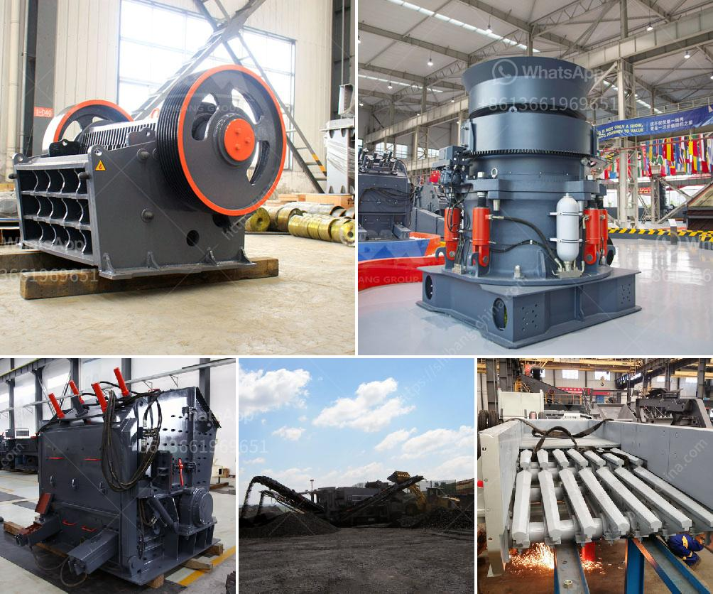

<h3>how to set up a granite quarry</h3>
Granite is a highly durable and popular natural stone used in a variety of construction and interior design projects. The extraction process of granite involves massive amounts of effort, planning, and investment. Therefore, setting up a granite quarry can be quite a challenging task. In this article, we will discuss the essential steps to help you set up your own granite quarry successfully.

First and foremost, it is crucial to conduct detailed research on potential quarry sites. Look for areas rich in granite deposits and ensure that the quarry's location is strategically placed for efficient transportation of the finished product. Collaborating with a geologist or conducting geological surveys can help determine the quality and quantity of granite available.

Once you have identified a suitable site, securing the required permits and licenses is essential. Consult with local authorities and adhere to all legal regulations, environmental standards, and land use policies. It may be necessary to consult an attorney experienced in mining regulations to ensure compliance throughout the process.

Next, you will need to invest in heavy machinery and equipment for mining operations. This includes excavators, crushers, loaders, and trucks capable of handling the massive granite blocks. Additionally, ensure the availability of power, water, and other utility requirements needed for running the quarry effectively.

It is also crucial to develop a sound business plan and financial projections. The initial investment for setting up a granite quarry can be substantial, so consider securing funding through bank loans, partnerships, or government grants. A well-defined business plan will also help attract potential investors and partners.

As you begin quarrying operations, ensure strict adherence to safety protocols and employ qualified personnel with experience in granite extraction. Regular maintenance of machinery and equipment is vital to ensure their longevity, efficiency, and safety.

Finally, establish a reliable distribution network to market and sell your granite products. Reach out to potential buyers in the construction industry, interior designers, and stone distributors. Participating in trade shows and creating an online presence will help promote your quarry and attract customers.

Setting up a granite quarry requires comprehensive planning, careful execution, and diligent marketing efforts. By following these steps, you can embark on a successful journey to establish your own granite quarry.
<h3>Contact us</h3><ul><li><strong>Whatsapp:&nbsp;<a href="https://wa.me/8613661969651">+8613661969651</a></strong></li><li><a href="https://swt.shibang-china.com/?git&amp;zhl&amp;how to set up a granite quarry"><strong>Online Service(chat now)</strong></a></li></ul><h3>Related</h3><ul><li><a href='granite gypsum quarry.md'>granite gypsum quarry</a></li><li><a href='coal screening plant.md'>coal screening plant</a></li><li><a href='sand and gravel crusher.md'>sand and gravel crusher</a></li><li><a href='100tpd gold processing plant.md'>100tpd gold processing plant</a></li><li><a href='cost of quarry crusher machines.md'>cost of quarry crusher machines</a></li></ul>