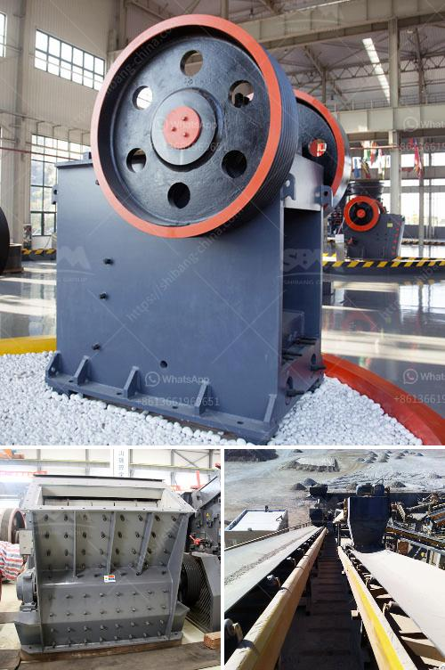

<h3>how to start a robo sand machinery</h3>
Robo sand is an essential construction material nowadays. It is manufactured by crushing granite rocks using modern machinery, ensuring consistent quality and minimal impurities. Starting a robo sand machinery can be a lucrative business opportunity for aspiring entrepreneurs.

1. Market Research: Conduct thorough market research to understand the demand and supply dynamics of robo sand in your area. Identify potential customers, such as construction companies, contractors, and individuals involved in the construction industry.

2. Business Plan: Develop a comprehensive business plan, highlighting your objectives, target market, competition analysis, marketing strategies, and financial projections. Seek professional help, if needed, to create an effective plan that covers all aspects of your venture.

3. Capital Investment: Determine the amount of capital required to set up the machinery and other infrastructure. Consider the cost of acquiring land, machinery, raw materials, labor, and other operational expenses. Explore various funding options, such as bank loans, partnerships, or seeking investors.

4. Location: Choose an appropriate location for your robo sand machinery setup. Look for an area with ample space, good connectivity, and availability of basic amenities. Ensure that the location adheres to local zoning and environmental regulations.

5. Machinery Selection and Installation: Research and select suitable machinery for your robo sand plant. The machinery should be efficient, reliable, and capable of producing the desired output. Consult with manufacturers or industry experts to make informed decisions. Once procured, install the machinery properly and ensure its smooth functioning.

6. Procurement of Raw Materials: Establish reliable sources for procuring granite rocks and other essential raw materials required for robo sand production. Negotiate competitive prices and maintain a consistent supply chain to avoid any interruptions in production.

7. Quality Control: Implement stringent quality control measures to ensure that your robo sand meets the required standards and specifications. Regularly test samples and maintain quality records to build trust among your customers.

8. Marketing and Sales: Develop effective marketing strategies to promote your robo sand brand. Utilize both traditional and digital marketing channels to reach your target audience. Attend construction expos, engage in social media marketing, and collaborate with local construction companies to increase visibility.

9. Regulatory Compliance: Ensure compliance with all relevant laws and regulations governing the sand mining and manufacturing industry. Obtain necessary permits and licenses to operate your robo sand machinery legally and ethically.

10. Continuous Improvement: Seek customer feedback and monitor industry trends to identify areas for improvement. Continuously invest in research and development to enhance the quality of your product and stay ahead of the competition.

Starting a robo sand machinery requires careful planning, investment, and market analysis. With strategic execution and commitment to quality, you can establish a successful venture in this promising industry.
<h3>Contact us</h3><ul><li><strong>Whatsapp:&nbsp;<a href="https://wa.me/8613661969651">+8613661969651</a></strong></li><li><a href="https://swt.shibang-china.com/?git&amp;zhl&amp;how to start a robo sand machinery"><strong>Online Service(chat now)</strong></a></li></ul><h3>Related</h3><ul><li><a href='grinding roller mills manufacturer from china.md'>grinding roller mills manufacturer from china</a></li><li><a href='used raymond mills barite raymond mill.md'>used raymond mills barite raymond mill</a></li><li><a href='cyclone sand separator for sand mining.md'>cyclone sand separator for sand mining</a></li><li><a href='brushes for conveyor belts.md'>brushes for conveyor belts</a></li><li><a href='micron grinding unit menufacture plant in bewar.md'>micron grinding unit menufacture plant in bewar</a></li></ul>