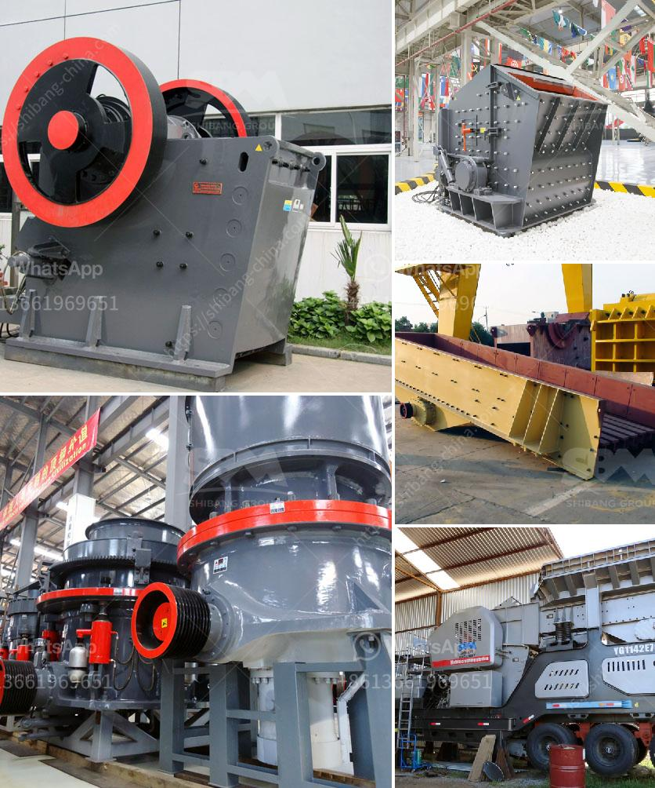

<h3>how to start a rock quarry business</h3>
Starting a rock quarry business is a daunting task that involves a lot of preparation and careful planning. The first step in starting your quarry business is to identify the resources and reserves within your quarry. This will involve conducting geological surveys to determine the types of rocks and minerals present in the area. By understanding the specific geological features of your quarry, you can better assess its potential for profitability.

Once you have determined the resources available, you will need to secure the necessary permits and licenses required to operate a quarry. It is important to research the local regulations and comply with any environmental or zoning requirements. Additionally, you may need to obtain permission from local authorities and landowners depending on the location of your quarry.

After obtaining the necessary approvals, you can begin the process of acquiring the equipment and machinery needed to operate your quarry. This could include excavators, loaders, trucks, crushers, and other heavy machinery. It is essential to choose equipment that is durable and can withstand the demands of a rock quarry business.

Furthermore, you will need to establish relationships with suppliers and distributors to ensure a steady supply of materials and an efficient delivery process. Building strong partnerships with reputable suppliers will not only help you maintain consistent stock levels but also ensure the quality of the materials you provide to your customers.

Marketing and promotion are also key aspects to consider when starting a rock quarry business. Developing a comprehensive marketing strategy that includes online and offline advertising, as well as networking within the construction and building industries, can help you attract customers and create a strong presence in the market.

In conclusion, starting a rock quarry business requires significant planning and preparation. By conducting thorough research, obtaining necessary permits, securing quality equipment, and implementing effective marketing strategies, you can successfully launch and operate a profitable rock quarry business.
<h3>Contact us</h3><ul><li><strong>Whatsapp:&nbsp;<a href="https://wa.me/8613661969651">+8613661969651</a></strong></li><li><a href="https://swt.shibang-china.com/?git&amp;zhl&amp;how to start a rock quarry business"><strong>Online Service(chat now)</strong></a></li></ul><h3>Related</h3><ul><li><a href='to buy gypsum calcination rotary kiln plant.md'>to buy gypsum calcination rotary kiln plant</a></li><li><a href='how to make a stone crushing plant.md'>how to make a stone crushing plant</a></li><li><a href='sell stone crusher in philippines.md'>sell stone crusher in philippines</a></li><li><a href='contact list of stone crusher companies in south africa.md'>contact list of stone crusher companies in south africa</a></li><li><a href='jual stone crusher mobile cap 30 tph in indonesia.md'>jual stone crusher mobile cap 30 tph in indonesia</a></li></ul>