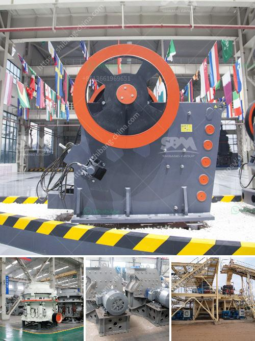

<h3>how to start gold mining in ghana</h3>
Ghana is renowned for its vast gold reserves, making it an attractive destination for individuals and companies looking to dive into the mining industry. However, starting a gold mining business in Ghana requires meticulous planning and strategic investments.

Firstly, it is important to conduct thorough research on the local mining laws and regulations in Ghana. Familiarize yourself with the legal requirements, environmental standards, and the process of obtaining the necessary licenses and permits. This knowledge will guide you through the various stages of setting up your gold mining operation and ensure compliance with the country's regulations.

Securing a viable mining site is another critical step. Identify areas with proven gold deposits and assess their accessibility and potential profitability. Consult with local communities and other mining industry players to gain insights into the mining landscape and potential challenges you may face.

Once you have selected a suitable mining site, it is crucial to evaluate the financial feasibility of your venture. Conduct a cost-benefit analysis to estimate the capital requirements, ongoing operational costs, and the potential returns on investment. Seek advice from financial experts or potential investors to determine the viability of your business plan.

Furthermore, it is essential to assemble a capable team with expertise in mining operations, geology, and regulatory compliance. Recruitment efforts should focus on identifying skilled individuals who can manage the technical aspects of gold extraction, geological surveys, and sustainable mining practices.

Finally, secure the necessary funding for your mining project. Depending on the scale of your operation, seek investment from either private investors, financial institutions, or mining development funds. Present a well-structured business plan detailing your project's potential, the anticipated risks, and how you plan to manage them effectively.

Embarking on a gold mining journey in Ghana can be a lucrative endeavor worldwide, but it requires meticulous planning, knowledge of local laws and regulations, expert team formation, and secure funding. By following these guidelines, aspiring miners can navigate the challenges and set themselves up for a successful and sustainable operation.
<h3>Contact us</h3><ul><li><strong>Whatsapp:&nbsp;<a href="https://wa.me/8613661969651">+8613661969651</a></strong></li><li><a href="https://swt.shibang-china.com/?git&amp;zhl&amp;how to start gold mining in ghana"><strong>Online Service(chat now)</strong></a></li></ul><h3>Related</h3><ul><li><a href='stone crusher manufacturers in india.md'>stone crusher manufacturers in india</a></li><li><a href='mobile stone crushers for sale south africa.md'>mobile stone crushers for sale south africa</a></li><li><a href='machinery required to setup cement plant.md'>machinery required to setup cement plant</a></li><li><a href='feasibility study of cement plant project pdf.md'>feasibility study of cement plant project pdf</a></li><li><a href='iron ore vibrator screen.md'>iron ore vibrator screen</a></li></ul>