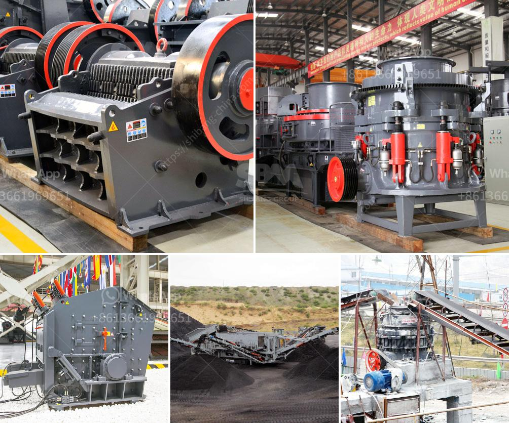

<h3>hp cone crusher device</h3>
A cone crusher is a device used to crush stones or other solid materials efficiently and reliably. The robust design of the machine ensures its durability and performance in various crushing applications. Its outstanding features make it a versatile choice among vertical shaft impactors, gyratory crushers, and other primary crushing equipment.

One of the outstanding features of the HP cone crusher is its hydraulic system. This feature helps to adjust the crusher setting in an instant and ensures consistent product size throughout the crushing process. The hydraulic system also enables the clearing of the crushing chamber quickly and easily, reducing downtime and increasing productivity.

The HP cone crusher is known for its high crushing efficiency. It can easily turn the hardest stones into gravel or sand and deliver consistent output quality. With a large crushing ratio and high-quality end product, the HP cone crusher is the ideal choice for secondary and tertiary crushing applications.

Another great feature of the HP cone crusher is its versatility. With a wide range of operational capabilities, it can be used in various industries, including mining, construction, and recycling. Whether it's crushing aggregate for concrete or processing ore for extraction, the HP cone crusher can handle it all. Its versatility also extends to different types of materials, from hard rocks to soft stones.

The HP cone crusher is also known for its high automation level. With the continuous monitoring and adjustment of the settings, it helps improve the crusher's performance and maximizes its output. The automation system can also detect an overload condition and adjust the crusher setting to prevent damage to the machine or downtime.

One of the key advantages of the HP cone crusher is its easy maintenance. With its accessible components and user-friendly design, the machine can be serviced and maintained without any hassle. This reduces maintenance costs and ensures long-term reliability and performance.

In conclusion, the HP cone crusher is a reliable and efficient crushing device that can turn the hardest stones into gravel or sand with ease. It has many outstanding features that make it a versatile choice in various crushing applications. Its hydraulic system, high crushing efficiency, versatility, automation, and easy maintenance are just a few of the reasons why the HP cone crusher stands out among its competitors. Whether it's mining, construction, or recycling, this powerful machine is sure to deliver exceptional results.
<h3>Contact us</h3><ul><li><strong>Whatsapp:&nbsp;<a href="https://wa.me/8613661969651">+8613661969651</a></strong></li><li><a href="https://swt.shibang-china.com/?git&amp;zhl&amp;hp cone crusher device"><strong>Online Service(chat now)</strong></a></li></ul><h3>Related</h3><ul><li><a href='clay crusher machine for refractories.md'>clay crusher machine for refractories</a></li><li><a href='project report on quartz industries.md'>project report on quartz industries</a></li><li><a href='used stone crusher plant for sale in china.md'>used stone crusher plant for sale in china</a></li><li><a href='crushing and screening plant for sale.md'>crushing and screening plant for sale</a></li><li><a href='mobile cone crusher plant.md'>mobile cone crusher plant</a></li></ul>