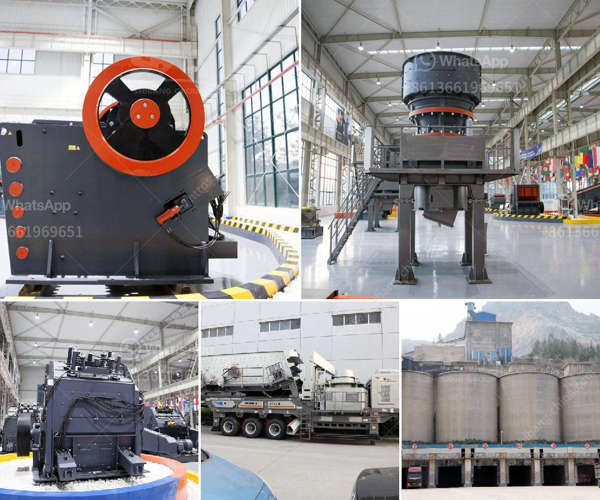

<h3>hydraulic control for jaw crusher</h3>
Hydraulic control for jaw crusher is a device developed on the basis of traditional hydraulic pressure pump control methods. It combines hydraulic technology, computer control technology and sensor technology, achieving the optimization of equipment performance. At the same time, it provides a stable and safe operating environment for the crusher.

The hydraulic control system for jaw crusher is mainly composed of three hydraulic cylinders and an automatic control system. The hydraulic cylinders are used to control the movement of the movable jaw and the fixed jaw, and adjust the discharge port. They provide overload protection for the crusher and prevent damage to the crusher when foreign objects enter it.

The automatic control system is used to monitor the hydraulic pressure of the hydraulic cylinders. It automatically adjusts the opening and closing of the discharge port according to the actual working conditions of the crusher, ensuring the normal operation of the equipment and improving its efficiency. The control system can also detect the overload of the crusher, automatically release the pressure in the hydraulic cylinders, and protect the crusher from damage caused by excessive overload.

The hydraulic control system for jaw crusher has several advantages over traditional control methods. Firstly, it can provide continuous and uniform feeding, ensuring that the crusher always operates under optimal conditions. Secondly, it can automatically adjust the size of the discharge port, improving the flexibility of the equipment and reducing the need for manual adjustment. Thirdly, it provides overload protection for the crusher, preventing damage caused by excessive load.

In addition, the hydraulic control system for jaw crusher has a simple structure, is easy to install and maintain, and has a long service life. It is suitable for various types of jaw crushers and can be applied to different working environments. With the continuous improvement of hydraulic technology, the control system is becoming more advanced and intelligent, bringing more convenience to users.

Overall, hydraulic control for jaw crusher is an important technology breakthrough in the field of crusher control systems. It not only greatly improves the efficiency of the equipment, but also provides a safer and more reliable operating environment. With the development and application of hydraulic technology, the control system will continue to improve, providing more intelligent and efficient solutions for the operation and maintenance of jaw crushers.
<h3>Contact us</h3><ul><li><strong>Whatsapp:&nbsp;<a href="https://wa.me/8613661969651">+8613661969651</a></strong></li><li><a href="https://swt.shibang-china.com/?git&amp;zhl&amp;hydraulic control for jaw crusher"><strong>Online Service(chat now)</strong></a></li></ul><h3>Related</h3><ul><li><a href='crusher manufacturer in pakistan in lahore.md'>crusher manufacturer in pakistan in lahore</a></li><li><a href='saudi arabia used conveyor belts price.md'>saudi arabia used conveyor belts price</a></li><li><a href='talcum powder bp usp manufacturers in india.md'>talcum powder bp usp manufacturers in india</a></li><li><a href='roller grinding machines for sale.md'>roller grinding machines for sale</a></li><li><a href='sample of project proposal in mining.md'>sample of project proposal in mining</a></li></ul>