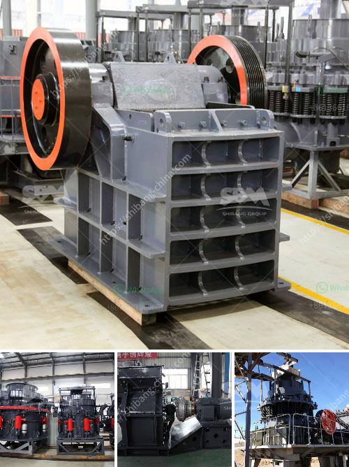

<h3>hydraulic css control for jaw crusher</h3>
The closed side setting (CSS) of a jaw crusher is a crucial parameter in obtaining product size distribution and grading. Taking into account the necessary production targets and desired particle size, the CSS of a crusher can be adjusted to achieve optimal performance.

With the increasing demand for aggregates and the growth of the overall construction industry, efficient crushing equipment has become a necessity. The jaw crusher, a popular primary crushing solution in quarrying applications, has remarkable advantages in terms of size reduction and processing capacity. However, to unleash its full potential, proper CSS control is essential.

Traditionally, CSS adjustment in a jaw crusher involved manually adjusting the position of a toggle plate to achieve the desired size. This process not only requires physical effort but also presents safety risks, as operators need to be in close proximity to moving parts. Moreover, manual CSS control often leads to inconsistent results and high product variability.

To overcome these challenges and provide a more efficient and safe solution, hydraulic CSS control has emerged as a game changer in the aggregates industry. This innovation allows for quick and easy adjustment of the CSS, ensuring accurate and reliable product gradation.

Hydraulic CSS control uses hydraulic cylinders to regulate the CSS with a simple push of a button. By replacing manual operations with automation, operators can now adjust the CSS on-the-fly, even during operation, without risking their safety. This not only increases productivity but also improves overall operational efficiency.

One of the key advantages of hydraulic CSS control is the ability to achieve consistent product size distribution. By precisely adjusting the CSS, the crusher can deliver the desired final product, meeting customer requirements and reducing the need for post-crushing screening. This results in significant time and cost savings, as well as improved quality control.

Furthermore, hydraulic CSS control enhances the versatility of the jaw crusher. Operators can easily adapt the crusher to different applications and materials by adjusting the CSS. Whether it's producing fine aggregates for concrete or coarse aggregates for road construction, hydraulic CSS control allows for seamless switching between various product sizes.

In addition to the operational benefits, hydraulic CSS control also extends the service life of the crushing equipment. By preventing excessive wear and tear caused by inconsistent CSS adjustments, the jaw crusher components can better withstand the demanding operational conditions. This translates into lower maintenance costs and reduced downtime, keeping the crusher in optimal condition for longer periods.

With these compelling advantages, hydraulic CSS control has quickly become an industry standard in modern jaw crushers. It offers a cost-effective and reliable solution for achieving the desired product size distribution, enhancing operational efficiency, and improving overall profitability.

In conclusion, hydraulic CSS control has revolutionized jaw crushers in the aggregates industry. Its ability to provide consistent and accurate product gradation, along with the operational benefits of safety, productivity, and versatility, makes it an indispensable tool for any crushing operation. As the demand for high-quality aggregates continues to rise, hydraulic CSS control will undoubtedly remain a game changer in the industry, ensuring efficient and reliable crushing operations.
<h3>Contact us</h3><ul><li><strong>Whatsapp:&nbsp;<a href="https://wa.me/8613661969651">+8613661969651</a></strong></li><li><a href="https://swt.shibang-china.com/?git&amp;zhl&amp;hydraulic css control for jaw crusher"><strong>Online Service(chat now)</strong></a></li></ul><h3>Related</h3><ul><li><a href='mineral processing ball mills nigeria.md'>mineral processing ball mills nigeria</a></li><li><a href='gypsum crusher manufacturing plant.md'>gypsum crusher manufacturing plant</a></li><li><a href='india stone crusher machine.md'>india stone crusher machine</a></li><li><a href='enquiry jaw crusher.md'>enquiry jaw crusher</a></li><li><a href='quartz stone quarry crusher in nigeria.md'>quartz stone quarry crusher in nigeria</a></li></ul>