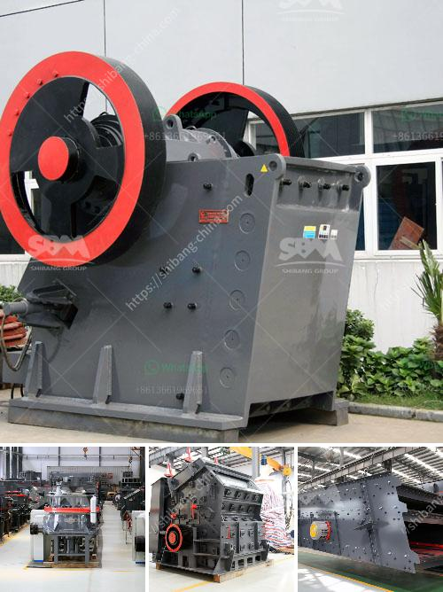

<h3>i am looking for a stone crusher in malaysia</h3>
Are you in need of a stone crusher in Malaysia? Look no further! There are several reputable and reliable sources to find the exact stone crusher you need, whether it is for construction purposes or for personal use.

Malaysia is known for its booming construction industry. With numerous ongoing projects, there is a huge demand for construction materials, including stones of various sizes. A stone crusher is a machine used to convert large stones into smaller sizes that can be used in construction or other purposes.

There are several types of stone crushers, such as jaw crusher, impact crusher, cone crusher, sand making machine, vertical shaft impact crusher, hammer crusher, etc., which are available in numerous specifications and sizes. These crushers are known for their high performance and efficiency.

When looking for a stone crusher in Malaysia, it is important that you consider a few factors to ensure that you get the best possible results. Here are some tips to help you in your search:

1. Determine your specific requirements: Before starting your search, it is crucial to identify your specific requirements. Are you looking for a stone crusher for construction purposes, or do you need it for personal use? The size, capacity, and type of the crusher may vary depending on your needs.

2. Research reputable suppliers: Once you know your requirements, start researching reputable stone crusher suppliers in Malaysia. Look for suppliers that have a good track record and are known for their high-quality products and excellent customer service.

3. Compare prices and specifications: Contact different suppliers and request quotations for the stone crusher that meets your requirements. Compare the prices and specifications provided by different suppliers to ensure you get the best value for your money.

4. Read reviews and testimonials: Before making a final decision, read reviews and testimonials from previous customers. This will give you insights into the supplier's reputation and the quality of their products and services.

5. Consider after-sales support: A stone crusher is a complex machine that may require maintenance and repairs over time. Therefore, it is important to consider the after-sales support provided by the supplier. Make sure they offer prompt and reliable technical support to address any issues that may arise.

In conclusion, finding a stone crusher in Malaysia is not a difficult task if you follow the right steps. Determine your specific requirements, research reputable suppliers, compare prices and specifications, read reviews and testimonials, and consider after-sales support. By doing so, you will be able to find a stone crusher that suits your needs and offers excellent performance and reliability. So, start your search today and find the perfect stone crusher in Malaysia!
<h3>Contact us</h3><ul><li><strong>Whatsapp:&nbsp;<a href="https://wa.me/8613661969651">+8613661969651</a></strong></li><li><a href="https://swt.shibang-china.com/?git&amp;zhl&amp;i am looking for a stone crusher in malaysia"><strong>Online Service(chat now)</strong></a></li></ul><h3>Related</h3><ul><li><a href='rencana anggaran biaya stone crusher.md'>rencana anggaran biaya stone crusher</a></li><li><a href='granite and marble factory for sale.md'>granite and marble factory for sale</a></li><li><a href='screening coal crushing plant.md'>screening coal crushing plant</a></li><li><a href='small ball mill for cement clinker grinding india.md'>small ball mill for cement clinker grinding india</a></li><li><a href='latest three roll mills.md'>latest three roll mills</a></li></ul>