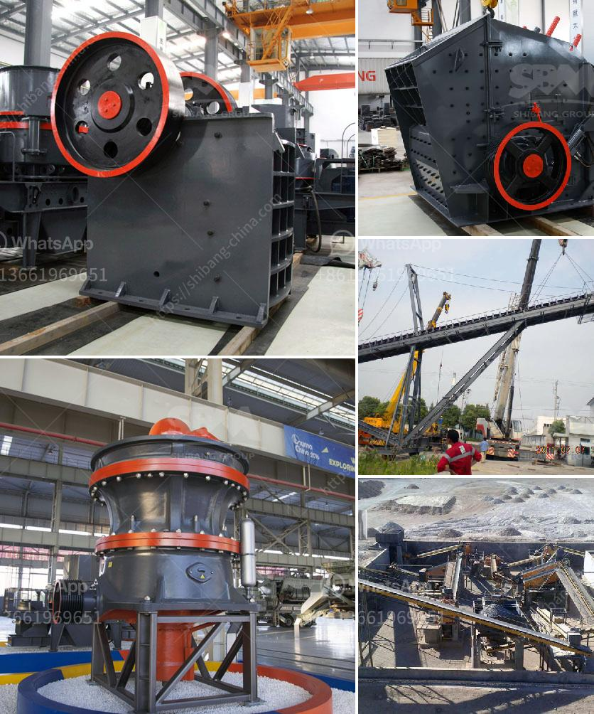

<h3>i want to buy a quarry machine nigeria</h3>
It is difficult to meet the growing demand for construction materials in Nigeria, particularly for granite and asphalt aggregates. With an increasing number of construction companies and government initiatives, the demand for high-quality aggregates is continually rising. To cater to this demand, I am considering purchasing a quarry machine for Nigeria.

A quarry machine is a versatile and powerful machine that helps with mining and constructing purposes. It is typically used to extract granite, limestone, sandstone, and other stones, providing clients with high-quality aggregates for construction projects.

One of the main reasons why I want to buy a quarry machine for Nigeria is the abundant resources available in the country. Nigeria is richly endowed with granite stone and other related solid minerals like limestone, dolomite, and marble. These resources have the potential to contribute significantly to the development of the construction industry in Nigeria.

By owning a quarry machine, I can offer a consistent supply of aggregates to construction companies involved in road construction, building foundations, and other infrastructure projects. Additionally, I can also supply materials to individuals for their personal construction needs, such as house foundations, driveways, and landscaping projects.

Investing in a quarry machine not only helps meet the increasing demand for construction materials but also presents a profitable business opportunity in Nigeria. With a growing economy and government focus on infrastructure development, the construction industry offers immense potential for growth and profitability.

Selecting the right quarry machine is crucial for maximizing productivity and efficiency. It is essential to choose a machine that can handle the specific requirements of the Nigerian market, including the harsh climate, remote locations, and uneven terrains. Conducting market research and consulting with industry experts would be crucial steps in making an informed decision.

In conclusion, the decision to purchase a quarry machine for Nigeria is driven by the need to meet the increasing demand for aggregates in the construction industry. With Nigeria's abundant resources and favorable market conditions, owning a quarry machine presents a profitable business opportunity. However, careful research and planning are necessary to ensure the machine's suitability for the Nigerian market.
<h3>Contact us</h3><ul><li><strong>Whatsapp:&nbsp;<a href="https://wa.me/8613661969651">+8613661969651</a></strong></li><li><a href="https://swt.shibang-china.com/?git&amp;zhl&amp;i want to buy a quarry machine nigeria"><strong>Online Service(chat now)</strong></a></li></ul><h3>Related</h3><ul><li><a href='crusher plant supplier in srilanka.md'>crusher plant supplier in srilanka</a></li><li><a href='coal pulverizer manufacturers.md'>coal pulverizer manufacturers</a></li><li><a href='vertical mills retention time formula.md'>vertical mills retention time formula</a></li><li><a href='grinding machine palletsgrinding machine palvisor.md'>grinding machine palletsgrinding machine palvisor</a></li><li><a href='europe used grinding equipment.md'>europe used grinding equipment</a></li></ul>