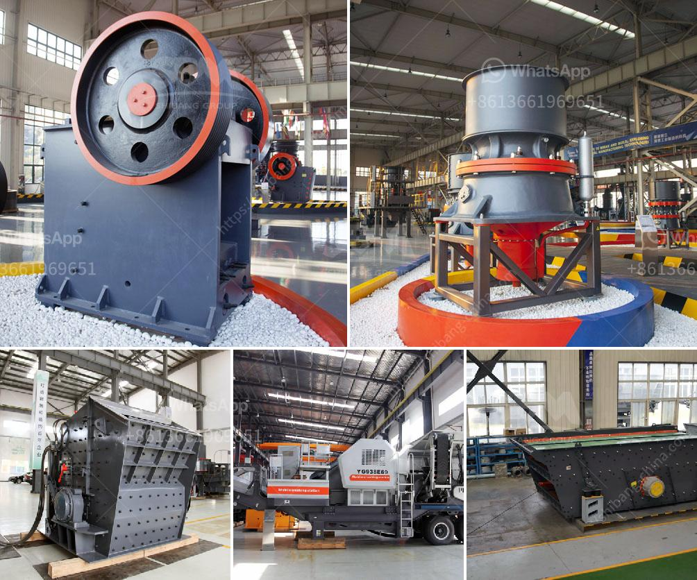

<h3>impact coal crusher</h3>
Impact coal crusher is one kind of coal mining equipment for coal mining process. The impact crusher is commonly used in coal mining equipment. However, the impact crusher is not only suitable for coal mining process, it's also suitable for all kinds of refractory matter, bauxite clinker, carborundum, glass raw materials such as hard, brittle, quartz, sandstone, limestone and so on.

When the impact coal crusher machine works, the motor drives the rotor rotate of the impact crusher with high speed, on the rotor where installed the hammers. When the materials get into the area which the hammers affect, under the impact function of the hammer at a high speed, the materials are thrown to the impact device above the rotor continuously. And then the materials are rebounded from the impact liner to the area where the hammers effects for being recrushed. The materials from large to small all to be crushed at the impact chamber repeatedly. The process won't stop till the material are crushed to the required size and then discharged from outlet of the impact coal crusher.

The impact coal crusher machine is designed for brittle materials crushing process in coal mining industry. In general, these crushers are simpler than jaw and cone crushers and units with equivalent throughput are much smaller in size. Coal roll crushers use a combination of compression and shear force with up to four crushing rolls to reduce a variety of friable materials, such as coal, salt, coke, gypsum, potash, lignite, trona, lime, limestone, glass, phosphate (and many others with similar characteristics) to a desired sized-cubical product with minimum fines.

The impact coal crusher machine consists of a rotor that revolves at a high speed to impact the incoming coal feedstock and crush it into smaller sizes. This action is repeated with each revolution along the length of the crushing chamber. The coal is crushed into small pieces by a hammering action and falling down through the slots of the crushing chamber to a lower section of the machine, which can be further crushed to the desired size and discharged from the outlet.

The impact coal crusher is commonly used in coal mining process and crushing production line, like coal jaw crusher, cone crusher, impact crusher, and hammer crusher, etc. The impact coal crusher plant has unique advantages relative to other coal crusher equipment such as coal hammer crusher.

Impact coal crusher machine consists of hammer crusher and vertical type coal crusher, impact crusher, and so on. Small-sized Vertical Type Coal Crusher With multi-layer hammer, the vertical type coal crusher makes its crushing operation from top to bottom. The working principle is shown below:

Overall, the impact coal crusher is mainly used for medium and fine crushing of coal, burned clinker, limestone, shale, coal gangue, and other materials with the compressive strength not exceeding 150MPa. And the discharge size can be adjusted according to the user's needs. Therefore, the impact coal crusher plant is suitable for coal mining process production lines that require regular final coal particle size.
<h3>Contact us</h3><ul><li><strong>Whatsapp:&nbsp;<a href="https://wa.me/8613661969651">+8613661969651</a></strong></li><li><a href="https://swt.shibang-china.com/?git&amp;zhl&amp;impact coal crusher"><strong>Online Service(chat now)</strong></a></li></ul><h3>Related</h3><ul><li><a href='portable conveyor belts for sale.md'>portable conveyor belts for sale</a></li><li><a href='price of stone crusher size.md'>price of stone crusher size</a></li><li><a href='stone crusher machines ebay.md'>stone crusher machines ebay</a></li><li><a href='river stone crusher for sale.md'>river stone crusher for sale</a></li><li><a href='bentonite pulverizer.md'>bentonite pulverizer</a></li></ul>