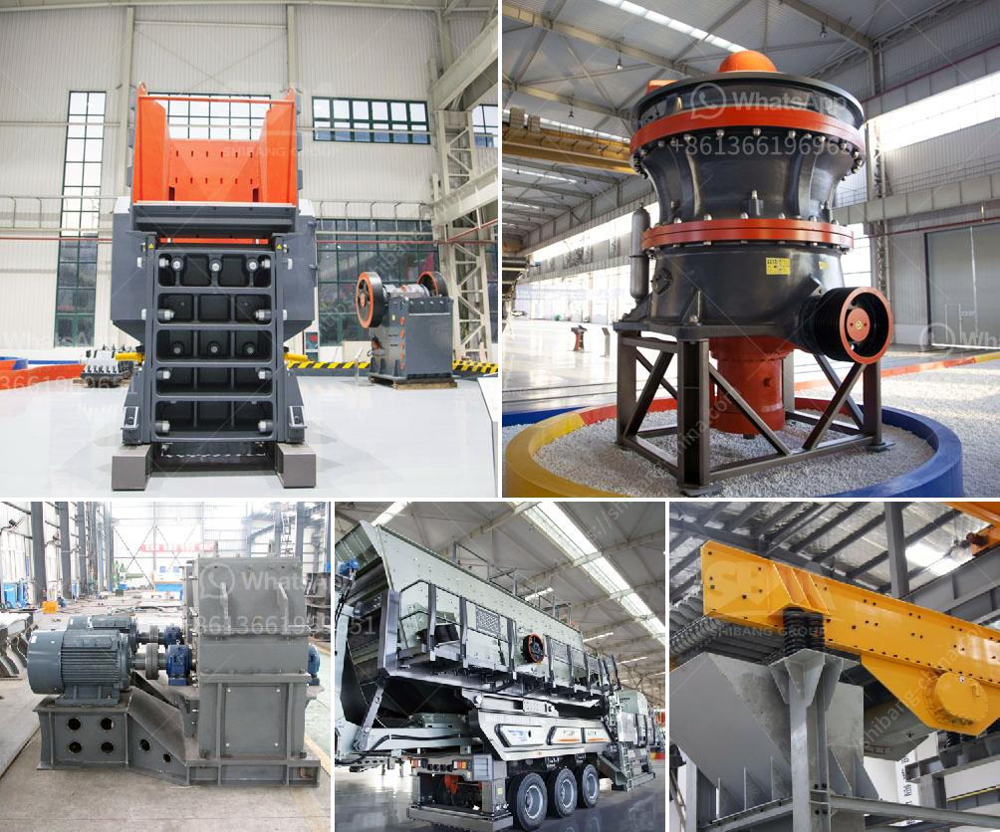

<h3>impact crusher for sale in saudi arabia</h3>
The impact crusher is a highly efficient crushing machine which utilizes the impact energy to crush the materials. Any unwanted external noise or dust is minimized, ensuring high quality output. With its revolutionary design, the impact crusher brings significant improvements in productivity and efficiency. This crushing machine has the capacity to process materials ranging from soft-sized rock to hard, abrasive and large-sized stones.

One of the main benefits of using an impact crusher is the ability to produce a larger quantity of fine end products. This is due to its high cutting-edge technology that delivers reliable and consistent performance. Another advantage of the impact crusher is its versatility, allowing it to perform a wide range of applications. From crushing concrete, asphalt, and limestone to recycling construction waste, this machine is suitable for various industries.

In line with global efforts to reduce carbon emissions, the impact crusher is designed to operate with low fuel consumption while maintaining high power output. This ensures a smaller carbon footprint, making it a sustainable choice for any environmentally conscious business. Additionally, the impact crusher is equipped with advanced dust suppression technology, minimizing dust emissions and enhancing air quality at the workplace.

Regular maintenance is crucial for assuring optimal performance and longevity of any machinery. The impact crusher is designed with ease of maintenance in mind. Its quick-release hammers and breaker plates facilitate easy replacement, reducing downtime. Furthermore, the machine is equipped with a hydraulic opening mechanism, allowing quick and convenient access to the internal parts. This results in reduced maintenance costs and increased productivity.

Saudi Arabia is a fast-growing market for the construction industry. With the government's focus on infrastructure development and urbanization, the demand for high-quality aggregates is continuously increasing. The impact crusher is a key equipment in this market. It plays a crucial role in the production of aggregates required for road construction, concrete manufacturing, and infrastructure projects.

With its ability to process various types of materials, the impact crusher is perfectly suited for the Saudi Arabian market requirements. The machine’s robust construction allows it to withstand extreme conditions, ensuring consistent performance throughout its lifetime. Its high productivity and efficiency make it a valuable asset for any construction company in Saudi Arabia.

The impact crusher is a powerful machine that utilizes the impact energy to crush materials. Its revolutionary design, high cutting-edge technology, and excellent environmental performance make it an ideal choice for crushing operations in Saudi Arabia. With its impressive versatility and ease of maintenance, the impact crusher is an excellent investment for any construction company looking to boost its productivity and efficiency. As the demand for high-quality aggregates continues to grow in Saudi Arabia, the impact crusher is expected to play a crucial role in shaping the future of the construction industry in the country.
<h3>Contact us</h3><ul><li><strong>Whatsapp:&nbsp;<a href="https://wa.me/8613661969651">+8613661969651</a></strong></li><li><a href="https://swt.shibang-china.com/?git&amp;zhl&amp;impact crusher for sale in saudi arabia"><strong>Online Service(chat now)</strong></a></li></ul><h3>Related</h3><ul><li><a href='manganese ore concentrate south africa.md'>manganese ore concentrate south africa</a></li><li><a href='aggregate equipment for sale.md'>aggregate equipment for sale</a></li><li><a href='mobile crushers concrete aggregate.md'>mobile crushers concrete aggregate</a></li><li><a href='equipment for ferro manganese plant.md'>equipment for ferro manganese plant</a></li><li><a href='standard operating procedure for coal pulverizer.md'>standard operating procedure for coal pulverizer</a></li></ul>