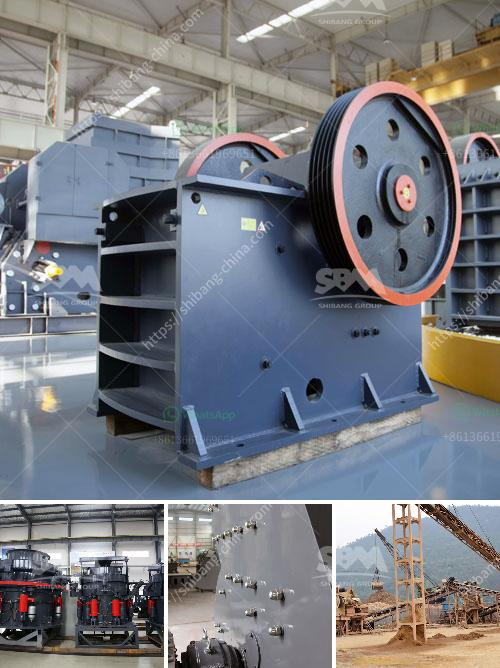

<h3>impact crusher for sale in turkey</h3>
The impact crusher is designed to crush materials into smaller pieces. It is often used for gravel or construction waste recycling. With a high efficiency and low maintenance, the impact crusher is becoming an ideal choice for crushing plants.

One of the key benefits of the impact crusher is its versatility. It is capable of performing secondary, tertiary, or quaternary crushing, depending on the application. This means it can be used in various industries, such as mining, cement, and construction.

In Turkey, there is a growing number of companies that specialize in the production of impact crushers. These machines are widely used in the Turkish market and abroad. They are known for their high-quality construction and reliable performance.

The impact crusher for sale in Turkey has been favored by many businesses due to its ability to crush materials into a fine particle size. This makes it suitable for breaking down hard rocks and even recycling construction waste. The crushed materials can be reused or sold for various purposes.

Another advantage of the impact crusher is its compact size. It can be easily transported to different locations, making it a convenient option for many construction sites. Additionally, the impact crusher can be operated by a single person, reducing labor costs and increasing productivity.

One of the leading manufacturers of impact crushers in Turkey is BORATAS Machinery. They offer a wide range of impact crushers with different specifications to meet various customer requirements. These crushers are designed to provide high-performance crushing with minimal maintenance.

When considering the purchase of an impact crusher in Turkey, there are several factors to consider. The first is the size and type of material that will be crushed. Different crushers are designed for different types of materials, so it is important to choose one that is suitable for your specific needs.

Furthermore, the capacity of the crusher should also be considered. The capacity will determine how much material can be processed per hour or per day. It is important to choose a crusher that can handle the volume of material you need to process.

Finally, the cost of the impact crusher is an important factor to consider. It is advisable to compare prices from different manufacturers and suppliers to ensure you are getting a competitive price. Additionally, it is important to consider the warranty and after-sales service provided by the manufacturer.

In conclusion, the impact crusher is becoming an increasingly popular choice for crushing plants in Turkey. Its versatility, compact size, and high efficiency make it suitable for various industries. Whether you need to process hard rocks or recycle construction waste, the impact crusher offers a reliable and cost-effective solution.
<h3>Contact us</h3><ul><li><strong>Whatsapp:&nbsp;<a href="https://wa.me/8613661969651">+8613661969651</a></strong></li><li><a href="https://swt.shibang-china.com/?git&amp;zhl&amp;impact crusher for sale in turkey"><strong>Online Service(chat now)</strong></a></li></ul><h3>Related</h3><ul><li><a href='dolomite powder plant.md'>dolomite powder plant</a></li><li><a href='cone crusher south africa.md'>cone crusher south africa</a></li><li><a href='hammer crusher dimension.md'>hammer crusher dimension</a></li><li><a href='mobile cone crusher plant.md'>mobile cone crusher plant</a></li><li><a href='top crusher manufacturer.md'>top crusher manufacturer</a></li></ul>