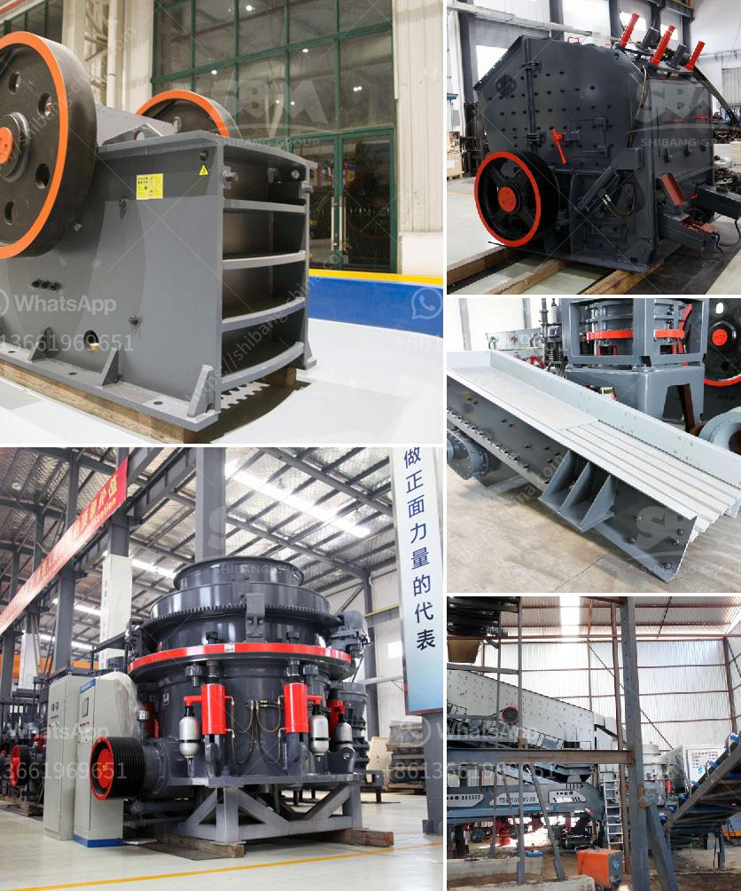

<h3>impact crusher machine manufacturer</h3>
The construction industry is growing at an exponential rate. With the ever-increasing urbanization and rapid industrialization, the demand for sturdy and reliable infrastructure is at its peak. One of the essential components of any building project is crushed stone. To meet the demand for crushed stone, numerous manufacturers are coming up with innovative machinery. One such machine that has revolutionized the construction industry is the impact crusher machine.

The impact crusher machine is a versatile and robust machine that can efficiently crush and shape various types of stones. Construction projects are not only about the quantity of stone required but also about the quality of stone used. The impact crusher machine helps in achieving the required shape of the stone by reducing the size of the stone particles. In addition, it helps in producing aggregate material with desirable specifications, making it suitable for various construction applications.

The impact crusher machine manufacturer plays a crucial role in ensuring that the machine produced is of high quality and meets the expectations of the customers. In recent years, there has been an upsurge in the number of impact crusher machine manufacturers. However, not all manufacturers can deliver machines that meet the stringent quality standards required for construction purposes.

A reputable impact crusher machine manufacturer invests in research and development to produce machines that are reliable, efficient, and durable. They pay attention to even the smallest details, ensuring that the machine can withstand the harsh conditions of construction sites. Such manufacturers use high-quality materials and advanced technology to manufacture impact crusher machines that have a long service life, require minimal maintenance, and provide maximum productivity.

Another factor that sets apart a reliable impact crusher machine manufacturer is their focus on customer satisfaction. They strive to meet the specific requirements of the customers and provide them with tailor-made solutions. Whether it is the capacity of the machine or the shape of the final product, they work closely with the customers to understand their needs and deliver machines that exceed their expectations.

Furthermore, a reputable manufacturer stands behind their product. They provide excellent after-sales service, including technical support, spare parts availability, and regular maintenance check-ups. This ensures that the impact crusher machines remain in optimal condition and continue to deliver high performance for years to come.

Investing in an impact crusher machine from a reliable manufacturer is a wise decision for any construction company. It not only helps in enhancing the efficiency and productivity of the construction process but also ensures that the quality of the construction materials is of the highest standard. The impact crusher machine is a game-changer in the construction industry, and it is the responsible manufacturers who are driving this change.

In conclusion, the impact crusher machine has become an essential tool for the construction industry. Its ability to crush stones efficiently and shape them to meet the desired specifications has made it indispensable. Nevertheless, it is crucial to choose an impact crusher machine manufacturer who produces high-quality machines and provides excellent after-sales service. Only then can the construction industry truly harness the potential of the impact crusher machine and build a stronger, more sustainable future.
<h3>Contact us</h3><ul><li><strong>Whatsapp:&nbsp;<a href="https://wa.me/8613661969651">+8613661969651</a></strong></li><li><a href="https://swt.shibang-china.com/?git&amp;zhl&amp;impact crusher machine manufacturer"><strong>Online Service(chat now)</strong></a></li></ul><h3>Related</h3><ul><li><a href='rock crusher in philippines.md'>rock crusher in philippines</a></li><li><a href='ballast crusher machine.md'>ballast crusher machine</a></li><li><a href='differences between hammer mill and ball mill.md'>differences between hammer mill and ball mill</a></li><li><a href='vibrating screen size decision.md'>vibrating screen size decision</a></li><li><a href='marble mining countries.md'>marble mining countries</a></li></ul>