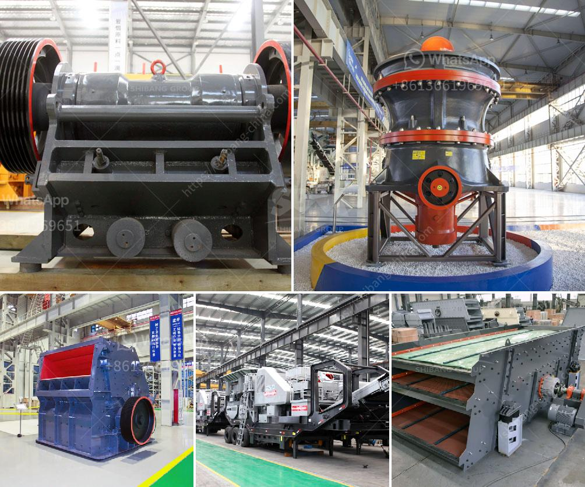

<h3>impact crusher suppliers italy</h3>
Italy has a strong reputation when it comes to quality industrial machinery and manufacturing. One sector that truly stands out is the construction equipment industry. Within this industry, a key player is the impact crusher suppliers in Italy. These suppliers provide exceptional crushing machines that are highly efficient and durable.

Impact crushers are widely used in various industries, including mining, quarrying, construction, and recycling. They consume less energy compared to other types of crushers and produce high-quality crushed materials. Italy, with its innovative technology and expertise, has become a popular destination for international buyers seeking reliable impact crusher suppliers.

Italian impact crusher suppliers are known for their cutting-edge technology and excellent craftsmanship. They invest heavily in research and development to provide the latest and most efficient crushing machines to their customers. The advanced features of these impact crushers allow for easy operation, maintenance, and reduced downtime.

Furthermore, Italian impact crusher suppliers focus on producing machines that are not only powerful but also environmentally friendly. They strive to minimize the impact of their machines on the environment by reducing emissions and optimizing energy consumption. This commitment to sustainability is in line with global efforts to protect the planet and create a greener future.

Italian impact crusher suppliers offer a wide range of models to cater to different industries and applications. Whether it's crushing large rocks in a quarry or processing construction debris on a demolition site, there is an impact crusher designed for the task. These machines can handle various materials, including limestone, concrete, asphalt, and more.

The reliability and durability of Italian impact crushers make them highly sought-after by businesses worldwide. When investing in industrial machinery, the longevity of the equipment is crucial to ensure a good return on investment. Italian suppliers understand this and provide robust machines built to withstand the demands of heavy-duty operations.

In addition to the quality of their machines, Italian impact crusher suppliers also prioritize customer service. They have a comprehensive support system in place, offering technical assistance, spare parts, and regular maintenance services. This ensures that their customers receive ongoing support and maximize the lifespan of their equipment.

Italy's impact crusher suppliers are widely recognized for their excellence in manufacturing and delivering top-notch crushing machines. Their commitment to innovation, sustainability, and customer satisfaction sets them apart from competitors. Buyers looking for reliable and efficient impact crushers can rely on the expertise of Italian suppliers to meet their requirements.

In conclusion, the impact crusher suppliers in Italy are leading the way in providing high-quality and efficient crushing machines. Their commitment to advanced technology, sustainability, and customer satisfaction has made them a preferred choice for buyers worldwide. Whether in construction, mining, or recycling, Italian impact crushers deliver the performance and durability that businesses demand.
<h3>Contact us</h3><ul><li><strong>Whatsapp:&nbsp;<a href="https://wa.me/8613661969651">+8613661969651</a></strong></li><li><a href="https://swt.shibang-china.com/?git&amp;zhl&amp;impact crusher suppliers italy"><strong>Online Service(chat now)</strong></a></li></ul><h3>Related</h3><ul><li><a href='granite and basalt crushing line ton per day.md'>granite and basalt crushing line ton per day</a></li><li><a href='100tph small capacity granite crusher.md'>100tph small capacity granite crusher</a></li><li><a href='list of machinery used for open pit mining.md'>list of machinery used for open pit mining</a></li><li><a href='high grinding mill quicklime.md'>high grinding mill quicklime</a></li><li><a href='europe used grinding equipment.md'>europe used grinding equipment</a></li></ul>