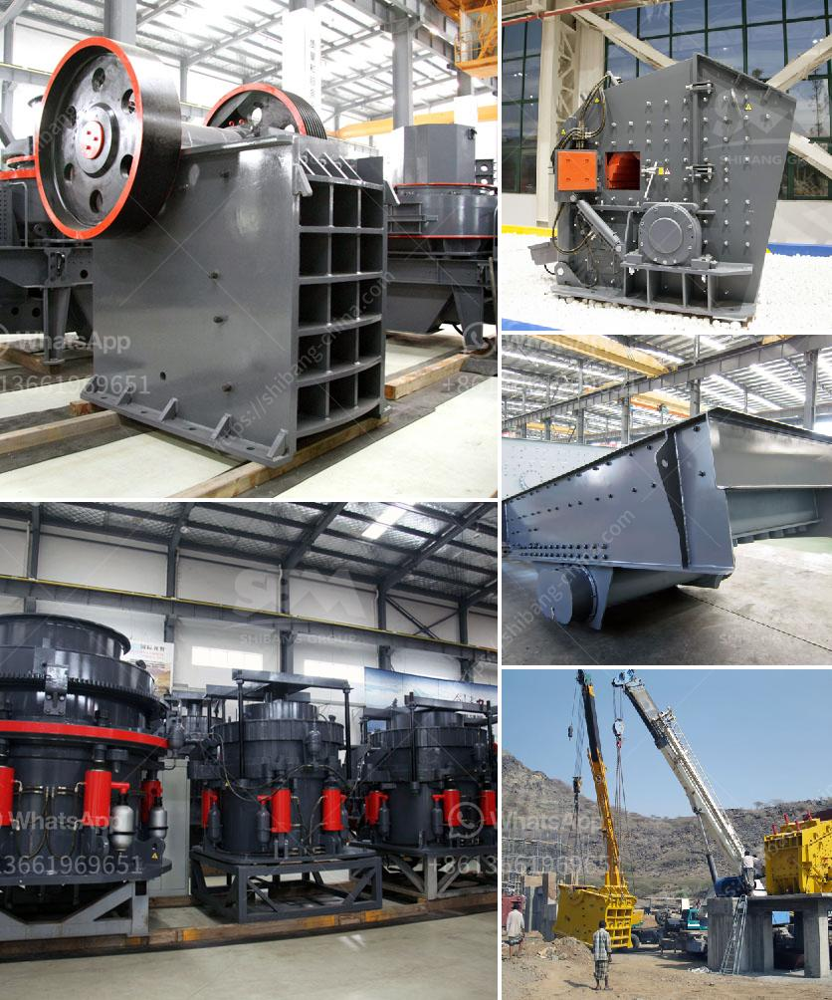

<h3>impact crushers manufacture</h3>
Impact crushers are widely used in the mining and quarrying industry due to their ability to efficiently and effectively reduce particle size. Impact crushers are manufactured to crush a variety of materials, including concrete, glass, lime stone, coal, and more. These machines are designed with a high-performance rotor that generates high-speed impacts, thus allowing for a greater reduction ratio and a superior end product.

Manufacturers of impact crushers employ the latest technology and materials to ensure quality and durability in their machines. They use high-strength steel materials for the construction of the frame and rotor, which can withstand the harsh conditions of the mining and quarrying environment. Additionally, impact crushers are equipped with heavy-duty bearings and seals to prevent any dust or debris from entering the crushing chamber, ensuring smooth operation and longer service life.

The manufacturing process of impact crushers involves several stages. Firstly, the raw materials are carefully selected and tested for their chemical compositions and physical properties. Then, they are combined in precise proportions and heated in a furnace to produce molten steel. This molten steel is then poured into molds and cooled to form the desired shapes of the frame, rotor, and other components. Afterward, these components undergo various machining operations, such as milling, drilling, and grinding, to achieve the required dimensions and surface finishes.

Manufacturers also pay close attention to the design and engineering of impact crushers. They continuously conduct research and development activities to improve the performance and efficiency of their machines. Advanced computer-aided design (CAD) software is used to create 3D models and simulate the crushing process, allowing manufacturers to optimize the design and make necessary modifications before final production. This ensures that the impact crushers deliver maximum productivity and minimum downtime for their users.

In conclusion, impact crushers are crucial equipment in the mining and quarrying industry. The manufacture of these machines involves advanced technology, high-quality materials, and careful design and engineering to produce reliable and efficient equipment. With their ability to rapidly reduce particle size, impact crushers contribute to the production of superior-quality aggregates and materials, making them integral to many industrial processes.
<h3>Contact us</h3><ul><li><strong>Whatsapp:&nbsp;<a href="https://wa.me/8613661969651">+8613661969651</a></strong></li><li><a href="https://swt.shibang-china.com/?git&amp;zhl&amp;impact crushers manufacture"><strong>Online Service(chat now)</strong></a></li></ul><h3>Related</h3><ul><li><a href='jaw crusher manufacturer germany.md'>jaw crusher manufacturer germany</a></li><li><a href='top crusher manufacturer.md'>top crusher manufacturer</a></li><li><a href='mobile crushing station philippines.md'>mobile crushing station philippines</a></li><li><a href='material of sectional conveyor belts.md'>material of sectional conveyor belts</a></li><li><a href='germany made grinding mill.md'>germany made grinding mill</a></li></ul>