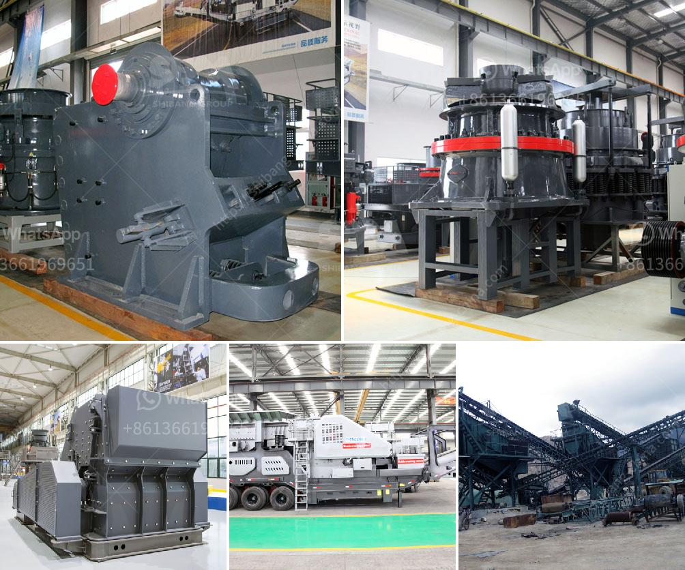

<h3>impact crushers manufacturers</h3>
Impact crushers are utilized in a wide range of applications across various industries. They are specifically designed to reduce larger-sized rocks, stones, or other materials into smaller, more manageable sizes. This machinery is commonly used in the mining, construction, and recycling industries, among others. However, when it comes to finding a reliable and efficient impact crusher, manufacturers play a crucial role. In this article, we will explore the impact crusher manufacturers who have made a significant impact (no pun intended!) on the industry.

One of the leading manufacturers in impact crushers is a well-known company called Metso. With over a century of experience in crushing and grinding, this Finnish-based company has become a global leader in impact crushing technology. Metso's impact crushers are designed to offer high performance and versatility in a wide range of applications. Their machines are built to withstand the toughest materials and conditions while providing excellent reduction ratios and product shape control.

Another prominent impact crusher manufacturer is Sandvik. With their headquarters in Sweden, Sandvik has been producing a wide range of equipment for the mining and construction industries since 1862. Their impact crushers are known for their reliability, high productivity, and excellent versatility. Sandvik's range of impact crushers includes both horizontal shaft impactors and vertical shaft impactors, offering customers a variety of options to suit their specific needs.

Tesab is another renowned manufacturer in the impact crusher industry. Based in Northern Ireland, Tesab has been producing high-quality equipment for the quarrying industry since 1992. Their impact crushers are particularly well-suited for applications involving hard and abrasive materials. Tesab offers a range of impact crushers that provide excellent performance, ease of operation, and low operating costs. Their machines are known for their robust construction and reliability, ensuring minimal downtime and maximum productivity.

When it comes to impact crushers, the German company Kleemann is also worth mentioning. Founded in 1857, Kleemann has been manufacturing a wide range of equipment for the quarrying and mining industries. Their impact crushers are highly efficient, offering high throughput rates and excellent reduction ratios. Kleemann's machines are known for their high quality, robust construction, and innovative features. They also offer a range of optional extras that further enhance the versatility and productivity of their impact crushers.

In conclusion, impact crushers are essential equipment for various industries, making the choice of a reliable manufacturer crucial. Metso, Sandvik, Tesab, and Kleemann are just a few of the leading manufacturers who have made a significant impact on the industry. These companies offer a range of impact crushers that provide high performance, versatility, and reliability. Whether it's reducing large-sized rocks or recycling materials, these manufacturers have the equipment to get the job done efficiently. So, when it comes to impact crushers, it's important to choose a manufacturer that has a proven track record and a commitment to quality and innovation.
<h3>Contact us</h3><ul><li><strong>Whatsapp:&nbsp;<a href="https://wa.me/8613661969651">+8613661969651</a></strong></li><li><a href="https://swt.shibang-china.com/?git&amp;zhl&amp;impact crushers manufacturers"><strong>Online Service(chat now)</strong></a></li></ul><h3>Related</h3><ul><li><a href='concrete crusher kenya.md'>concrete crusher kenya</a></li><li><a href='sand washing process.md'>sand washing process</a></li><li><a href='mobile crushing station philippines.md'>mobile crushing station philippines</a></li><li><a href='belt conveyor untuk batubara.md'>belt conveyor untuk batubara</a></li><li><a href='price 200 crusher price.md'>price 200 crusher price</a></li></ul>