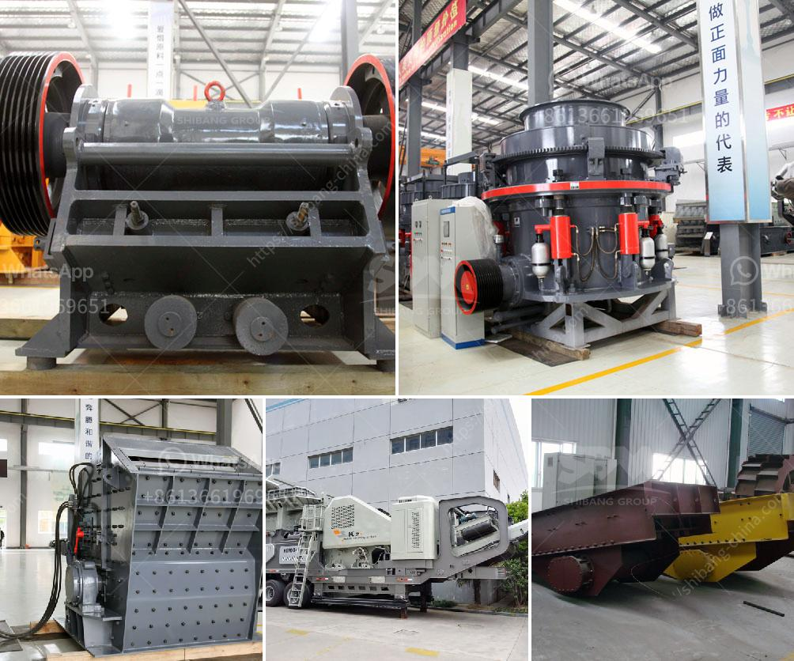

<h3>india copper mining equipment</h3>
India is one of the largest producers of copper ore and copper products in the world. With its rich copper reserves, India has been mining this precious metal for centuries. Copper mining is an important economic activity in various parts of the country, contributing significantly to the country's overall GDP. In order to extract copper ore from the earth, sophisticated mining equipment is required. This article explores the importance of mining equipment in India's copper mining industry.

Copper mining has a long history in India, dating back to more than 2000 years. The ancient copper mines of Khetri in Rajasthan were developed by the Indus Valley civilization. The copper produced from these mines was used for various purposes, including making tools, utensils, and ornamental objects. Over the years, the mining techniques and equipment have evolved, enabling the industry to extract copper more efficiently.

The mining equipment used in India's copper mining industry includes drilling rigs, hydraulic excavators, wheel loaders, backhoe loaders, dump trucks, and tippers. With the growth of the mining industry, the size and scope of mining equipment has also increased, leading to a wide variety of choices for miners. Today, there are specialized mining equipment available for different stages of copper mining, including exploration, extraction, and processing.

Exploration is the first step in the copper mining process. It involves identifying potential copper deposits and understanding their geological characteristics. Equipment used for exploration includes drilling rigs, which are used to bore holes into the ground to collect samples of rocks and minerals. These samples are then analyzed to determine the presence of copper and other valuable minerals.

Once a copper deposit is discovered, the extraction process begins. This involves removing the overburden, which is the layer of soil and rock that lies above the copper deposit. Excavators and loaders are used to remove the overburden and expose the copper ore. These machines are equipped with powerful hydraulic systems and attachments, allowing them to handle large volumes of material with ease.

After the copper ore is exposed, it is extracted using various methods, including underground mining and open-pit mining. Underground mining involves tunneling into the earth to reach the copper deposit. Specialized equipment such as drilling jumbos, loaders, and haul trucks are used in underground mines to extract the ore. Open-pit mining, on the other hand, involves digging a large pit or quarry to extract the ore. Equipment used in open-pit mining includes excavators, haul trucks, and draglines.

The extracted copper ore is then transported to the processing plant, where it is crushed, milled, and concentrated. Crushing and milling equipment, such as crushers and ball mills, are used to reduce the size of the ore particles. Concentration equipment, such as flotation cells and magnetic separators, are used to separate the copper minerals from the gangue (worthless material).

In conclusion, copper mining is a significant economic activity in India, and the mining equipment used in the industry plays a crucial role in its success. From exploration to extraction and processing, a wide range of mining equipment is required to extract copper ore efficiently. With advancements in technology, mining equipment has become more sophisticated, allowing for greater productivity and efficiency in the copper mining process.
<h3>Contact us</h3><ul><li><strong>Whatsapp:&nbsp;<a href="https://wa.me/8613661969651">+8613661969651</a></strong></li><li><a href="https://swt.shibang-china.com/?git&amp;zhl&amp;india copper mining equipment"><strong>Online Service(chat now)</strong></a></li></ul><h3>Related</h3><ul><li><a href='small sand making machine pictures and price.md'>small sand making machine pictures and price</a></li><li><a href='rotary kilns in indonesia.md'>rotary kilns in indonesia</a></li><li><a href='zambia mining conveyor belt.md'>zambia mining conveyor belt</a></li><li><a href='grinding roller mills manufacturer from china.md'>grinding roller mills manufacturer from china</a></li><li><a href='vibrating feeder zsw parts.md'>vibrating feeder zsw parts</a></li></ul>