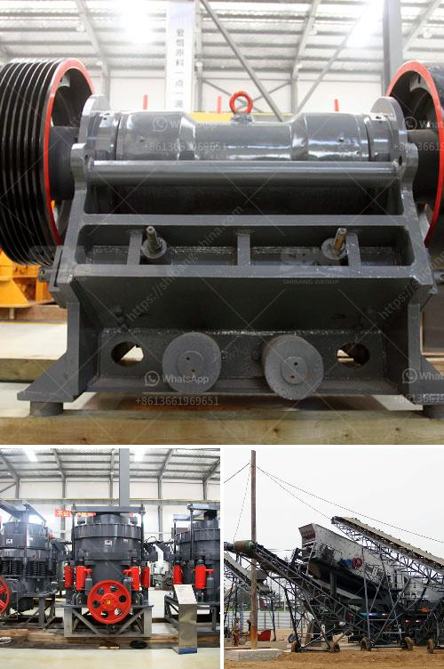

<h3>india stone crusher machine</h3>
Stone crushers are primarily small scale industries in early times. They are also commonly found in various markets and construction sites as well. They provide basic material for road and building construction. They are highly popular in the mining industry due to their ability to subdivide large blocks into smaller pieces and achieve the desired product size with high efficiency.

India possesses both types of stone crushing machines, where the stones are reduced in size such as handheld or manually-operated stone crusher machines and those that are automated using newer technologies. The classification of stone crusher machines is based on the differing functionality and mode of operation.

With stone crushing, the stone is typically fed through a chute to the inside of a crushing chamber. An impact crusher, which uses impact force to break down materials, may be placed in the first stage of a crushing circuit. Jaw crusher, as the name suggests, works on the same principle as the human jaw. It has one stationary jaw (like the upper teeth set) and the other movable (like the lower teeth set), with the material being crushed between them. Roller crushers, on the other hand, are based on cylindrical rolls that crush by compressing and rotating simultaneously.

One of the best attributes of the Indian stone crusher machine is its versatility in terms of applications, as it can crush a wide range of materials. While maintaining the ability to handle hard rock and various recycling materials, we offer advanced hydraulic systems for over-loading protection and adjustment, making them highly energy-efficient as well.

Many stone crusher machines are available in various capacities, ranging from 30 to 500 tons per hour. With the increase in production and larger reduction ratios, the demand for larger and more productive machines is increasing in mines and quarries.

India has vast reserves of various stones - including granite, marble, sandstone, limestone, slate, and quartzite - spread out across the country. India is also one of the largest producers of stone, contributing to about 15% of the world's total production. The mining industry in India is a major economic activity which contributes significantly to the country's GDP.

Stone crushers are key equipment for crushing, grinding, and quarrying operations. With proper selection of crushing chamber and eccentricity, a wide range of models and configurations can be catered to meet the requirements of different plants and materials.

India is the largest producer of stone aggregates, accounting for more than half of the total production. The stone crusher machines are located nearer to the source of raw material such as Stone mines, River Beds, etc.

SBM is a famous stone crusher machine manufacturer, and offer types of crushers, grinding mills, feeder, and screen for sale used for stone crushing plant in India. SBM also design stone crushing plant layout for the quarry plant and mine. 

Stone crusher machine manufacturer in India offer types of crusher for sale with best price used for stone crushing plant in India. Slang Crusher Machine in India - Heavy

Slang Crusher Machine Profile: Slang crusher machine in the huge stones crushed into small stones, the first crusher is usually referred to as a "master" is primarily due to the broken jaw crusher modeling. The crusher is simple in structure, reliable, easy maintenance in the crushing chamber which is safe and convenient, sturdy and durable, high compressive strength. We offer crushed stone bulk delivery in NJ and Staten Island and have crushed stone

of smaller quantities available at our East Brunswick, NJ location..., Whether you are interested in bulk delivery of crushed stone or rocks, or you prefer smaller quantities of stone on your own, we offer the crushed stone you need...

In the Stone Crushing Plant Project Report last to tell you about the whole stone crushing plant project the most important part – Jaw Crusher, because Jaw crusher crushing ratio, uniform product Liaoduo, the characteristics of simple structure, almost every stone crushing plant project it will be used, so choose a good jaw crusher is very important.
<h3>Contact us</h3><ul><li><strong>Whatsapp:&nbsp;<a href="https://wa.me/8613661969651">+8613661969651</a></strong></li><li><a href="https://swt.shibang-china.com/?git&amp;zhl&amp;india stone crusher machine"><strong>Online Service(chat now)</strong></a></li></ul><h3>Related</h3><ul><li><a href='high reversible mill with 750 mm diameter rolls.md'>high reversible mill with 750 mm diameter rolls</a></li><li><a href='crusher hp300 cone.md'>crusher hp300 cone</a></li><li><a href='crushing stone crusher in spinal.md'>crushing stone crusher in spinal</a></li><li><a href='used mine equipment price.md'>used mine equipment price</a></li><li><a href='stone crusher contact.md'>stone crusher contact</a></li></ul>