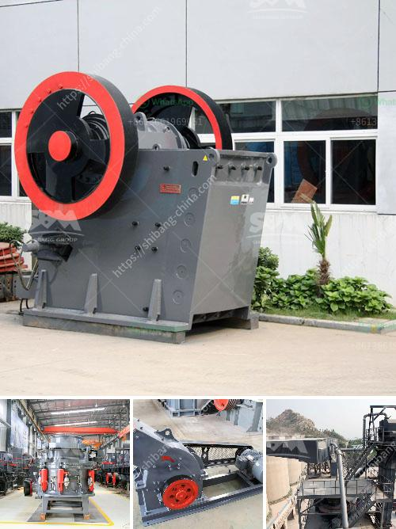

<h3>indonesia roll crushers</h3>
Roll crushers, also known as roller crushers, are widely used in industries such as mining and metallurgy for crushing medium-hard materials. These machines feature a pair of rollers that crush the material between them, maximizing efficiency and reducing energy consumption. In Indonesia, roll crushers have become an essential tool for various applications due to their ability to efficiently break down materials into smaller sizes.

One of the key advantages of roll crushers is their versatility. They can be used to crush a wide range of materials, including limestone, granite, coal, and even precious metals. This versatility makes roll crushers ideal for diverse industries that require efficient crushing solutions. Whether it is for construction materials, mining operations, or chemical processing plants, roll crushers in Indonesia are commonly utilized for various applications.

In the mining industry, roll crushers are often used to crush ore particles into finer sizes. This enables easier extraction of valuable minerals and metals, improving the overall efficiency of the mining process. Additionally, roll crushers can prevent the generation of dust, which is beneficial for both worker safety and environmental reasons. The ability to control the size of the crushed material also allows for more precise sorting and separation, enabling better recovery rates of valuable minerals.

In construction and building materials industries, roll crushers are employed for the production of aggregates. These machines can quickly and efficiently reduce the size of large rocks into smaller, consistent pieces. The resulting crushed material is then used in various construction applications, such as concrete production, road building, and structural fill. The use of roll crushers in these industries helps optimize the use of natural resources and reduces waste.

Furthermore, roll crushers are also widely used in the manufacturing industry for processing a variety of materials. They can crush particles of different sizes, shapes, and hardness levels, making them suitable for crushing materials like ceramics, chemicals, and plastics. The precise control over the size of the crushed material ensures consistency in downstream processes, such as mixing, molding, and extrusion.

Indonesia, with its vast abundance of natural resources, is an ideal market for roll crushers. The country's mining and construction industries, in particular, can greatly benefit from the efficient crushing solutions that these machines provide. As the demand for processed materials continues to grow, roll crushers offer a reliable and capable solution for meeting these needs.

In conclusion, roll crushers have become an indispensable tool in many industries in Indonesia. Their versatility, efficiency, and ability to crush a wide range of materials make them suitable for applications in mining, construction, and manufacturing. With their ability to optimize the use of resources and improve mineral recovery rates, roll crushers have proven to be an excellent investment for companies in various sectors. As Indonesia continues to develop and expand its industrial activities, the demand for roll crushers is expected to rise, further solidifying their place as an essential crushing solution in the country.
<h3>Contact us</h3><ul><li><strong>Whatsapp:&nbsp;<a href="https://wa.me/8613661969651">+8613661969651</a></strong></li><li><a href="https://swt.shibang-china.com/?git&amp;zhl&amp;indonesia roll crushers"><strong>Online Service(chat now)</strong></a></li></ul><h3>Related</h3><ul><li><a href='cost of silica sand mine equipment.md'>cost of silica sand mine equipment</a></li><li><a href='coal conveyor supplier from india.md'>coal conveyor supplier from india</a></li><li><a href='granite and marble factory for sale.md'>granite and marble factory for sale</a></li><li><a href='jaw crusher machine in saudi.md'>jaw crusher machine in saudi</a></li><li><a href='stone crusher plant cost in saudi.md'>stone crusher plant cost in saudi</a></li></ul>