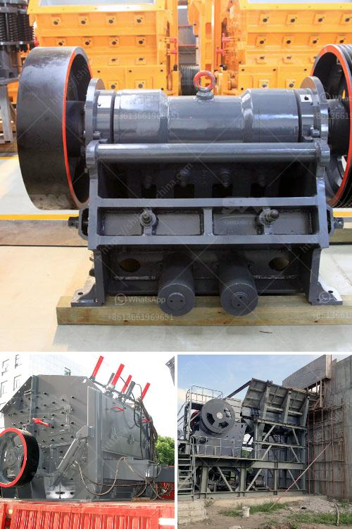

<h3>indopol roller grinding mills</h3>
Grinding is an essential process used in various industries to reduce the size of particles and achieve the desired product quality. Indopol Roller Grinding Mills, manufactured by Indopol Food Processing Machinery Private Limited, offer an effective and reliable solution for grinding various types of grains, spices, and other products.

These roller grinding mills are designed to provide consistent and efficient grinding performance, ensuring high-quality output. The key to their superior performance lies in their unique design features and advanced technology.

One of the distinctive features of Indopol Roller Grinding Mills is their three-stage roller arrangement. This arrangement includes a set of large-diameter top rollers followed by smaller intermediate and bottom rollers. This configuration ensures a uniform and efficient grinding process, as the grain is subjected to multiple stages of grinding, resulting in reduced particle size and improved texture.

Furthermore, these mills are equipped with highly durable and hard-wearing grinding rolls made from chilled cast iron. The use of such high-quality materials ensures a longer lifespan and optimal performance even under challenging grinding conditions.

The advanced control system of the Indopol Roller Grinding Mills allows precise adjustment of the roller gap and speed. This enables operators to finely tune the grinding process according to the specific requirements of the product, achieving consistent and uniform grinding results.

Moreover, Indopol Roller Grinding Mills are known for their straightforward operation and minimal maintenance requirements. They are designed to withstand heavy-duty usage, delivering efficient performance day after day without compromising on quality.

In conclusion, Indopol Roller Grinding Mills offer an effective and reliable solution for achieving efficient and consistent grinding of various grains, spices, and other products. With their unique design features, high-quality construction, and advanced control system, these mills ensure optimal performance and produce high-quality output. Whether it's for small-scale production or large-scale industrial operations, Indopol Roller Grinding Mills are an excellent choice for enhancing grinding efficiency and achieving desired particle size reduction.
<h3>Contact us</h3><ul><li><strong>Whatsapp:&nbsp;<a href="https://wa.me/8613661969651">+8613661969651</a></strong></li><li><a href="https://swt.shibang-china.com/?git&amp;zhl&amp;indopol roller grinding mills"><strong>Online Service(chat now)</strong></a></li></ul><h3>Related</h3><ul><li><a href='stone crushing plant project report.md'>stone crushing plant project report</a></li><li><a href='crawler mobile crushers.md'>crawler mobile crushers</a></li><li><a href='chinese aggregate crusher suppliers.md'>chinese aggregate crusher suppliers</a></li><li><a href='working of hydraulic circuit for milling machine.md'>working of hydraulic circuit for milling machine</a></li><li><a href='how to calcium plant manufacturer.md'>how to calcium plant manufacturer</a></li></ul>