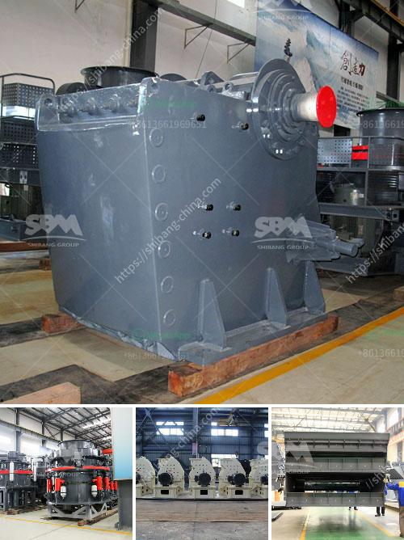

<h3>industrial application ball mill</h3>
The Ball Mill is a key equipment for grinding materials, widely used in powder-making production line such as cement, silicate sand, new-type building material, refractory material, fertilizer, ore dressing of ferrous metal and non-ferrous metal, glass ceramics, etc. Ball Mill can grind various ores and materials with dry type or wet type.

The Industrial Application of Ball Mill is an essential piece of equipment in the concentration plant, which grind non-ferrous metal or ferrous metal. Ball grinder rotates materials with the help of grinding medium—steel balls, causing the balls to fall back into the cylinder and onto the material to be ground. The rotation is usually between 4 to 20 revolutions per minute, depending upon the diameter of the mill. The larger the diameter, the slower the rotation. If the peripheral speed of the mill is too great, it begins to act like a centrifuge and the balls do not fall back, but stay on the perimeter of the mill.

Different materials are used as media, including ceramic balls, flint pebbles, and stainless steel balls. An internal cascading effect reduces the material to a fine powder. Finally, the ground material is discharged from the mill through discharge slots provided in the mill tube, through a discharge wall or through the end trunnion.

In industrial applications, the inner surface of the mill is lined with mill liners protecting the steel body of the mill and also provide options for steel as well as ceramic balls to be used to grind the material.

In conclusion, the Ball Mill is a versatile equipment widely used in industrial applications. It performs the tasks of grinding, blending, homogenizing, and particle size reduction with efficiency and reliability.
<h3>Contact us</h3><ul><li><strong>Whatsapp:&nbsp;<a href="https://wa.me/8613661969651">+8613661969651</a></strong></li><li><a href="https://swt.shibang-china.com/?git&amp;zhl&amp;industrial application ball mill"><strong>Online Service(chat now)</strong></a></li></ul><h3>Related</h3><ul><li><a href='aggregates crusher plant for sale in south africa.md'>aggregates crusher plant for sale in south africa</a></li><li><a href='price copper concentration plant.md'>price copper concentration plant</a></li><li><a href='small ball mill for cement clinker grinding india.md'>small ball mill for cement clinker grinding india</a></li><li><a href='how to start a rock quarry business.md'>how to start a rock quarry business</a></li><li><a href='clay crusher machine for refractories.md'>clay crusher machine for refractories</a></li></ul>