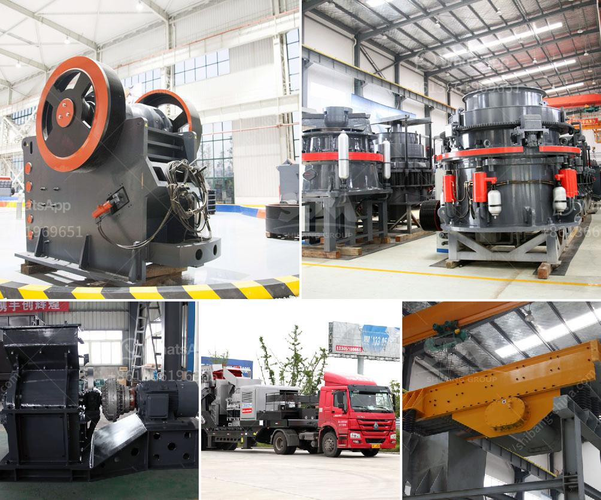

<h3>industrial conveyor belts dimensions</h3>
Industrial conveyor belts play a crucial role in various manufacturing processes, facilitating the movement of raw materials, goods, and finished products. These belts are designed to withstand heavy loads, rigorous operations, and diverse working conditions. To ensure maximum efficiency and productivity, it is essential to consider the dimensions of the industrial conveyor belts.

The dimensions of industrial conveyor belts vary depending on the specific application and industry requirements. Typically, the width of these belts ranges from 12 inches to 48 inches. However, certain specialized applications may require wider belts. The chosen width of a conveyor belt depends on factors such as the size and weight of the product being transported, production capacity, and available space in the manufacturing facility.

Another important dimension to consider is the length of the conveyor belt. This dimension can vary significantly based on the layout of the manufacturing facility and the distance required to transport the materials or products. Conveyor belts can be as short as a few feet or as long as several miles, depending on the specific application.

The thickness of conveyor belts is another crucial dimension. This dimension can determine the belt's durability, resistance to wear and tear, and ability to handle the load. Industrial conveyor belts come in various thicknesses, ranging from 3/16 inches to 1 inch or even more, depending on the application and material being transported.

Additionally, the speed of the conveyor belt is an important factor to consider when determining dimensions. Different applications require different speeds, and the dimensions of the belt should accommodate the desired speed range. Conveyor belts can typically operate at speeds varying from a few feet per minute to several hundred feet per minute.

In conclusion, the dimensions of industrial conveyor belts are customized to meet specific application requirements. Consideration should be given to the width, length, thickness, and speed of the belt to ensure efficient and reliable material handling. It is crucial to choose the appropriate dimensions to enhance production capacity, product quality, and overall operational efficiency.
<h3>Contact us</h3><ul><li><strong>Whatsapp:&nbsp;<a href="https://wa.me/8613661969651">+8613661969651</a></strong></li><li><a href="https://swt.shibang-china.com/?git&amp;zhl&amp;industrial conveyor belts dimensions"><strong>Online Service(chat now)</strong></a></li></ul><h3>Related</h3><ul><li><a href='cement clinker grinding plant india.md'>cement clinker grinding plant india</a></li><li><a href='nickel slag grinding project in turkey.md'>nickel slag grinding project in turkey</a></li><li><a href='the cost to construct a cement factory.md'>the cost to construct a cement factory</a></li><li><a href='silica sand refind machines in germany.md'>silica sand refind machines in germany</a></li><li><a href='quarry equipment for sale in indonesia.md'>quarry equipment for sale in indonesia</a></li></ul>