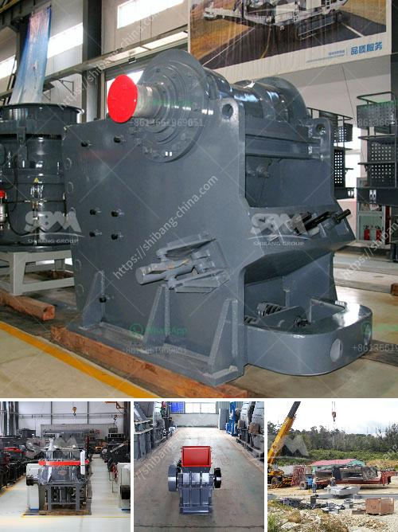

<h3>industrial glass crusher worldcrushers</h3>
The use of glass in various industries has become increasingly prevalent in recent years. From construction and architecture to packaging and transportation, glass is widely utilized due to its transparency, durability, and aesthetic appeal. However, discarding glass waste can pose significant environmental challenges, as glass takes thousands of years to decompose in landfills. To address this issue, industrial glass crushers have emerged as a practical solution for recycling and reusing glass materials.

An industrial glass crusher is a machine specifically designed to pulverize glass bottles and jars to facilitate the recycling process. The crushed glass can be used as a raw material in various industries, including construction, manufacturing, and landscaping. This innovative technology not only reduces the volume of glass waste but also minimizes the need for production of new glass, thus conserving natural resources.

One prominent player in the field of industrial glass crushers is WorldCrushers. They offer a range of industrial glass crushers, specifically designed to meet the diverse needs of different industries. These crushers are powerful machines that employ a combination of blades and hammers to break down glass bottles into smaller fragments. The glass fragments can then be further processed into various products, such as fiberglass, asphalt, countertops, and ceramic tiles.

The benefits of using industrial glass crushers are manifold. Firstly, they significantly reduce the amount of glass waste that goes to landfills, thereby reducing the environmental impact. Additionally, recycling glass saves energy, as it requires less energy to process recycled glass compared to manufacturing new glass from raw materials. This not only conserves natural resources but also reduces greenhouse gas emissions associated with glass production. Furthermore, utilizing crushed glass in various industries reduces the demand for other materials, such as sand and gravel, decreasing pressure on natural resources.

Industrial glass crushers are versatile machines that can handle different types and sizes of glass bottles and jars. They often come with adjustable settings to accommodate various glass thicknesses and shapes. Moreover, some crushers offer additional features, such as automatic feeding mechanisms and safety measures to prevent accidents. With easy operation and maintenance, these crushers are user-friendly and can be integrated into existing recycling facilities or installed as standalone units.

In conclusion, industrial glass crushers play a vital role in recycling and reusing glass waste, thus addressing the environmental challenges associated with glass disposal. WorldCrushers, a leading provider of industrial glass crushers, offers reliable and innovative machines that enable efficient glass recycling. By transforming glass waste into valuable raw materials, these crushers contribute to a sustainable future by conserving natural resources and reducing environmental pollution. With the constant advancements in technology, the future of glass recycling looks promising, with industrial glass crushers at the forefront of this crucial transformation.
<h3>Contact us</h3><ul><li><strong>Whatsapp:&nbsp;<a href="https://wa.me/8613661969651">+8613661969651</a></strong></li><li><a href="https://swt.shibang-china.com/?git&amp;zhl&amp;industrial glass crusher worldcrushers"><strong>Online Service(chat now)</strong></a></li></ul><h3>Related</h3><ul><li><a href='conveyor belts for dies.md'>conveyor belts for dies</a></li><li><a href='stone crusher for road construction.md'>stone crusher for road construction</a></li><li><a href='pebble crusher shanghai manufacturers.md'>pebble crusher shanghai manufacturers</a></li><li><a href='india copper mining equipment.md'>india copper mining equipment</a></li><li><a href='mobile crushing plants.md'>mobile crushing plants</a></li></ul>