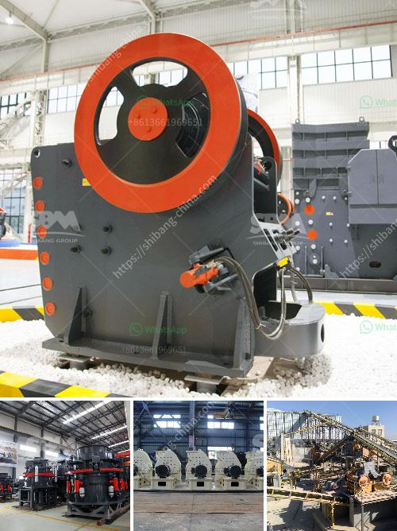

<h3>industrial grinder fine powder</h3>
Industrial grinders are powerful machines used in various industries to break down materials into fine powder. These machines efficiently and effectively pulverize materials, crushing them into smaller particles that are easier to handle and process.

One of the primary uses of industrial grinders is in the manufacturing and production of chemicals. These machines are often used to grind down raw materials, such as minerals or ore, into a fine powder. The fine powder produced by industrial grinders is then used to create various chemical compounds and products. This process enhances the reactivity and surface area of the materials, making them more suitable for chemical reactions.

Pharmaceutical and food industries also heavily rely on industrial grinders to produce fine powder. In the pharmaceutical industry, these machines are used to reduce the size of active ingredients, excipients, and other substances used in medicine production. By reducing the particle size, these powders can be easily mixed, formulated, and used in various drug delivery systems.

Similarly, in the food industry, industrial grinders play a crucial role in producing spices, flavorings, and other powdered food products. The fine powder produced by these grinders enhances the flavors and aromas, making them more potent and uniform. It also improves their solubility and dispersibility, ensuring they mix evenly and smoothly in recipes.

Moreover, industrial grinders find applications in industries such as plastics, rubber, and construction materials. In the plastics and rubber industry, these machines are used to break down waste materials or scrap into fine powder, which can be reused or further processed. In the construction materials industry, grinders are employed to crush construction waste, such as concrete and bricks, into fine powder, which can then be used as a base material for new construction projects.

Industrial grinders are designed to handle heavy-duty tasks, ensuring durability and efficiency in their operation. They come in various sizes and types, including ball mills, hammer mills, and jet mills, each designed for specific applications. With advances in technology, these machines have become more precise, allowing for control over particle size distribution and ensuring the production of uniform and consistent powders.

In conclusion, industrial grinders are vital machines used in a wide range of industries to convert materials into fine powder. From chemicals and pharmaceuticals to food and construction materials, these grinders play a crucial role in enhancing the quality and properties of the final products. Their efficiency, durability, and precision make them valuable assets for industries that rely on finely ground materials.
<h3>Contact us</h3><ul><li><strong>Whatsapp:&nbsp;<a href="https://wa.me/8613661969651">+8613661969651</a></strong></li><li><a href="https://swt.shibang-china.com/?git&amp;zhl&amp;industrial grinder fine powder"><strong>Online Service(chat now)</strong></a></li></ul><h3>Related</h3><ul><li><a href='barite crushing machine.md'>barite crushing machine</a></li><li><a href='roller mill machine for mining.md'>roller mill machine for mining</a></li><li><a href='business plan for stone crushing in kenya.md'>business plan for stone crushing in kenya</a></li><li><a href='concrete crushing machine price in china.md'>concrete crushing machine price in china</a></li><li><a href='conveyor belts for sand for sale.md'>conveyor belts for sand for sale</a></li></ul>