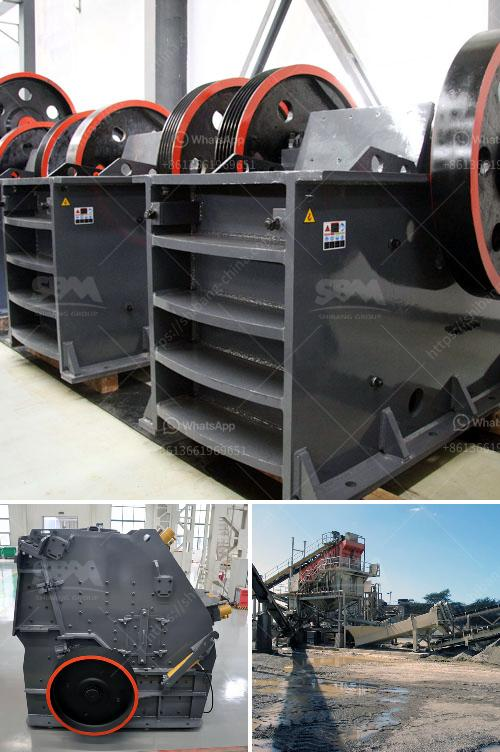

<h3>industrial mining jaw crushers south africa</h3>
Industrial mining jaw crushers in South Africa are primarily used as a primary crusher, reducing run of mine ore to manageable sizes for the next stage of processing. In the South African mining industry, there are several different types of crushers designed to handle various sizes and types of materials. Some crushers are designed for relatively soft materials like coal, while others can handle hard rock, ores, and other abrasive materials.

Jaw crushers are commonly used in the mining industry due to their simplicity and versatility. They are capable of handling a wide range of materials, including abrasive rock and ore. Their compact size and efficient operation make them ideal for use in confined spaces and remote locations.

One key advantage of jaw crushers is their ability to handle large feed sizes. This makes them suitable for primary crushing where a large amount of material needs to be reduced in size. The crushing action generated by the jaw crusher is exerted on the feed material between the fixed and movable jaws, resulting in a high compression ratio and a uniform product size.

In addition to their primary crushing capabilities, jaw crushers can also be used in secondary and tertiary crushing applications. This versatility allows for greater flexibility in the mining operation, enabling different types of materials to be processed efficiently.

Industrial mining jaw crushers in South Africa are typically used as stand-alone units or as part of a larger plant setup. They have an intensive liner configuration, ensuring longer life of the manganese steel jaw plates and maintain the crusher in excellent condition.

These crushers are mainly used for primary and secondary crushing of various ores and rocks with compressive strength less than 320 MPa. The materials to be crushed can be hard, medium-hard, or soft minerals whose compressive strength should be not more than 320 MPa.

Overall, industrial mining jaw crushers in South Africa play a vital role in the mining and quarrying industry. They are robust machines capable of handling large feed sizes and producing a consistent and uniform product size. With their versatile applications and ease of operation, these crushers contribute to improved productivity and profitability for the mining operations in South Africa.
<h3>Contact us</h3><ul><li><strong>Whatsapp:&nbsp;<a href="https://wa.me/8613661969651">+8613661969651</a></strong></li><li><a href="https://swt.shibang-china.com/?git&amp;zhl&amp;industrial mining jaw crushers south africa"><strong>Online Service(chat now)</strong></a></li></ul><h3>Related</h3><ul><li><a href='jaw crusher for sale in spain.md'>jaw crusher for sale in spain</a></li><li><a href='silica sand refind machines in germany.md'>silica sand refind machines in germany</a></li><li><a href='marble quarry business plan.md'>marble quarry business plan</a></li><li><a href='mtw european type trapezium mill.md'>mtw european type trapezium mill</a></li><li><a href='coal processing plants.md'>coal processing plants</a></li></ul>