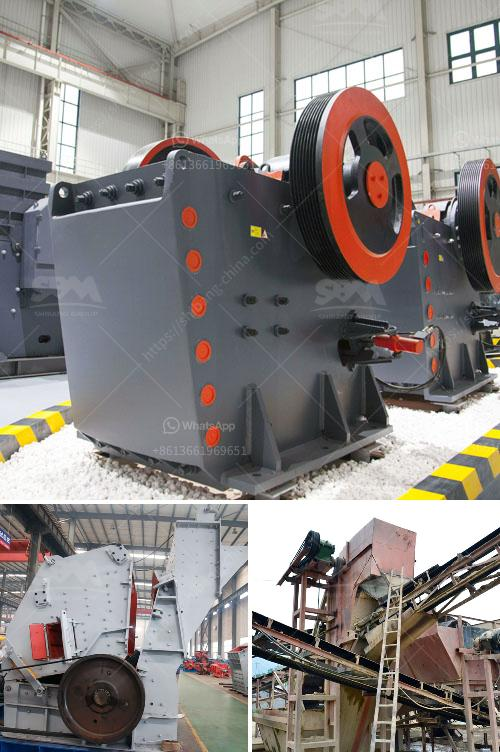

<h3>industrial roller ball mill</h3>
The industrial roller ball mill is a type of grinding equipment that has been extensively used for various applications in industrial and laboratory settings. This mill is a cylindrical device that rotates around a horizontal axis, with the material to be ground being fed into the mill through a central shaft. As the mill rotates, the grinding media, which can be made of steel balls or ceramic balls, crushes and grinds the material into fine powder or slurry.

The industrial roller ball mill offers several advantages over other types of grinding mills. Firstly, it has a simple and compact design, making it easy to operate and maintain. The mill consists of a drum that is mounted on bearings and is driven by a motor and gearbox. This design ensures smooth and efficient operation, with minimal vibrations and noise.

Secondly, the roller ball mill is highly efficient in grinding various types of materials. It can efficiently grind both wet and dry materials, including minerals, ores, chemicals, ceramics, and more. The grinding media inside the mill helps to break down the particles and improve the overall efficiency of the grinding process. Additionally, the mill can be equipped with a classifier or separator to further enhance the size reduction process.

Another significant advantage of the industrial roller ball mill is its versatility. The mill can be used for batch or continuous operations, making it suitable for both small-scale laboratory experiments and large-scale industrial production. Its modular design also allows for customization and easy integration into existing systems.

Moreover, the roller ball mill is known for its reliable and consistent performance. The mill is equipped with high-quality components that ensure long-term durability and efficient operation. Its robust construction can withstand heavy loads and tough working conditions, making it suitable for demanding industrial applications.

In conclusion, the industrial roller ball mill is a versatile and efficient grinding equipment that has been widely used in various industries. Its simple design, high grinding efficiency, and reliable performance make it an ideal choice for both laboratory and industrial applications. Whether for fine powder grinding, mixing, or dispersing, the roller ball mill offers a cost-effective and reliable solution for material processing needs.
<h3>Contact us</h3><ul><li><strong>Whatsapp:&nbsp;<a href="https://wa.me/8613661969651">+8613661969651</a></strong></li><li><a href="https://swt.shibang-china.com/?git&amp;zhl&amp;industrial roller ball mill"><strong>Online Service(chat now)</strong></a></li></ul><h3>Related</h3><ul><li><a href='machinery for magnesium extracted from dolomite.md'>machinery for magnesium extracted from dolomite</a></li><li><a href='recycled concrete manufacturers in shanghai.md'>recycled concrete manufacturers in shanghai</a></li><li><a href='mining crusher plants in egypt.md'>mining crusher plants in egypt</a></li><li><a href='mtw european type trapezium mill.md'>mtw european type trapezium mill</a></li><li><a href='conveyor chain suppliers south africa.md'>conveyor chain suppliers south africa</a></li></ul>