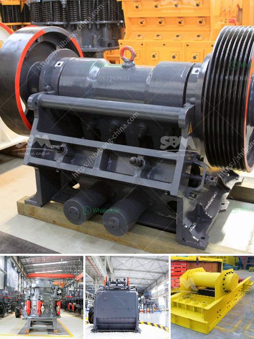

<h3>iron crusher supplier</h3>
When it comes to crushing materials, iron crushers are widely used in various industries such as mining, construction, metallurgy, and more. These machines are designed to break down large pieces of iron ore, granite, limestone, and other materials into smaller pieces for further processing. However, finding a reliable iron crusher supplier can be challenging, given the numerous options available in the market. In this article, we will introduce you to a trustworthy iron crusher supplier that can cater to all your crushing needs efficiently.

ABC Iron Crusher is a renowned supplier in the industry, offering a wide range of iron crushers that are both reliable and cost-effective. They have been providing high-quality crushing machines to customers worldwide for several decades, earning a solid reputation for their outstanding products and excellent customer service. Here are some reasons why ABC Iron Crusher is the go-to supplier for many businesses:

1. Comprehensive Product Range: ABC Iron Crusher offers an extensive selection of crushers to meet the diverse needs of their customers. Whether you require a jaw crusher, cone crusher, impact crusher, or any other type of iron crusher, they have it all. Their products are designed to handle different materials and various particle sizes, ensuring efficient crushing and optimal performance.

2. Quality and Durability: All iron crushers supplied by ABC Iron Crusher are manufactured using top-grade materials and advanced technology. These machines undergo rigorous quality inspections to ensure that they meet the highest industry standards. The durability and robustness of their crushers make them capable of withstanding heavy-duty applications, reducing downtime and maintenance costs.

3. Customization Options: ABC Iron Crusher understands that each customer has unique requirements. Therefore, they offer customization options to tailor the crushers according to specific needs. Whether it's adjusting the crushing chamber, modifying the feeding system, or incorporating additional features, their experienced engineers can provide solutions that cater to your individual needs.

4. Competitive Pricing: While maintaining the quality and performance of their products, ABC Iron Crusher offers competitive pricing. They aim to provide cost-effective solutions without compromising on the reliability and durability of their crushers. By partnering with them, you can obtain a high-quality iron crusher at a competitive price, enhancing your operational efficiency while saving costs.

5. Exceptional Customer Service: ABC Iron Crusher prioritizes customer satisfaction and strives to provide exceptional customer service. Their experienced team is always ready to assist you in choosing the right crusher, resolving any queries, and providing technical support throughout the entire process. Whether you need advice on installation, maintenance, or troubleshooting, their knowledgeable professionals are available to help.

In conclusion, ABC Iron Crusher is a reliable and experienced iron crusher supplier that can meet all your crushing needs effectively. With their comprehensive product range, quality and durability, customization options, competitive pricing, and excellent customer service, they have established themselves as a one-stop solution for businesses seeking high-quality crushing equipment. Contact ABC Iron Crusher today and experience the difference for yourself!
<h3>Contact us</h3><ul><li><strong>Whatsapp:&nbsp;<a href="https://wa.me/8613661969651">+8613661969651</a></strong></li><li><a href="https://swt.shibang-china.com/?git&amp;zhl&amp;iron crusher supplier"><strong>Online Service(chat now)</strong></a></li></ul><h3>Related</h3><ul><li><a href='buy quarry crusher machine from turkey.md'>buy quarry crusher machine from turkey</a></li><li><a href='aggregates for concrete crusher in nigeria.md'>aggregates for concrete crusher in nigeria</a></li><li><a href='raymond mill india.md'>raymond mill india</a></li><li><a href='price conveyor belts in malaysia.md'>price conveyor belts in malaysia</a></li><li><a href='alluvial wash plants in south africa.md'>alluvial wash plants in south africa</a></li></ul>