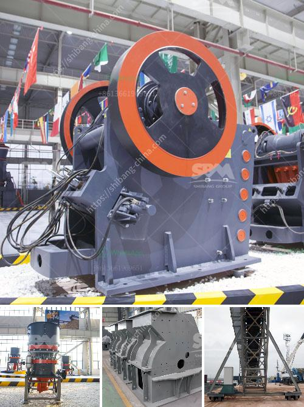

<h3>iron crushing plant in mexico</h3>
Mexico is known for its rich reserves of iron ore which is considered to be one of the largest in the world. Iron ore deposits are located in several states across the country, including Coahuila, Chihuahua, Durango, and Sonora. Mexico produces 42 million metric tons of iron ore annually.

The demand for iron ore in Mexico is primarily driven by the country's steel production industry. Mexico is one of the largest steel producers in Latin America, and its steel industry relies heavily on iron ore to produce steel products such as rebar, structural steel, and automotive parts.

To meet the growing demand for iron ore, several iron crushing plants have been established in Mexico. These crushing plants not only supply iron ore to the steel industry, but also to the construction industry. Iron ore is an important raw material for the construction of roads, bridges, and buildings.

One of the largest iron crushing plants in Mexico is located in the state of Colima. The plant has a capacity of crushing 3,000 tons of iron ore per hour. This large crushing plant is equipped with two crushers, each having a capacity of 2,500 tons per hour. The crushers break down the iron ore into smaller sizes which are then transported to the steel mills for further processing.

The iron crushing plant in Colima operates 24/7 to ensure a steady supply of iron ore to the steel and construction industries. The plant is equipped with advanced technology and machinery to efficiently crush and process the iron ore. The crushed iron ore is then transported by conveyor belts to storage silos where it is kept until it is needed for further processing.

The establishment of iron crushing plants in Mexico has significantly contributed to the country's economy. The steel industry, supported by a steady supply of iron ore, has become a major contributor to Mexico's GDP. The construction industry has also benefitted from the availability of crushed iron ore, which has helped in the development of infrastructure across the country.

In addition to its economic significance, the iron crushing plants have also created job opportunities for thousands of people in Mexico. The plants require a skilled workforce to operate and maintain the machinery. Many local residents have found employment in these plants, contributing to the growth of their communities.

However, it is important to note that while the iron crushing plants have brought economic benefits to Mexico, they have also raised environmental concerns. The extraction and processing of iron ore require the use of large amounts of water and energy, which can have a negative impact on the environment. Efforts are being made to mitigate these impacts through the implementation of sustainable practices and technologies in the iron crushing plants.

In conclusion, the establishment of iron crushing plants in Mexico has played a crucial role in meeting the country's growing demand for iron ore. These plants have not only contributed to the economic growth of Mexico but have also created job opportunities for thousands of people. However, it is important to balance the economic benefits with environmental sustainability to ensure a responsible and sustainable iron ore industry in Mexico.
<h3>Contact us</h3><ul><li><strong>Whatsapp:&nbsp;<a href="https://wa.me/8613661969651">+8613661969651</a></strong></li><li><a href="https://swt.shibang-china.com/?git&amp;zhl&amp;iron crushing plant in mexico"><strong>Online Service(chat now)</strong></a></li></ul><h3>Related</h3><ul><li><a href='marble powder mill.md'>marble powder mill</a></li><li><a href='quarry crusher equipments and machinery.md'>quarry crusher equipments and machinery</a></li><li><a href='used crushers sale usa.md'>used crushers sale usa</a></li><li><a href='ball mill vibration limits.md'>ball mill vibration limits</a></li><li><a href='mobile aggregates washing plant.md'>mobile aggregates washing plant</a></li></ul>