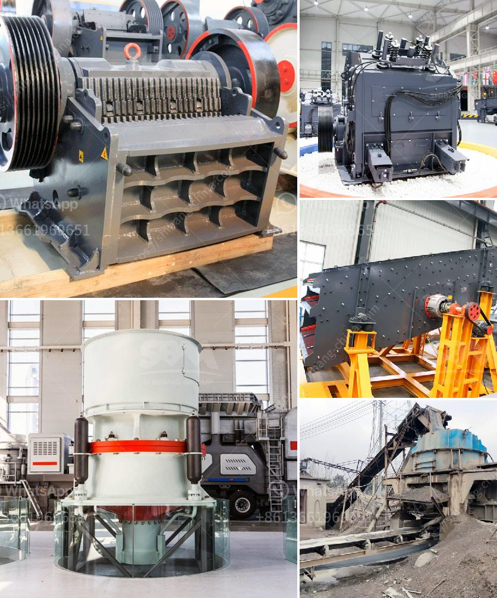

<h3>iron ore beneficiation plants price in china</h3>
Iron ore beneficiation plants in China have large potential for development, so the government is encouraging foreign companies to invest in iron ore beneficiation plants in China to ensure the utilization of high-quality resources and enhance the competitiveness of Chinese-made iron ore beneficiation plants.

With the increasing demand for iron ore in China's steel industry, the government has intensified its efforts to crack down on illegal mining activities and promote the sustainable development of the iron ore industry. As a result, many small-scale iron ore beneficiation plants have been shut down in China, and large-scale iron ore beneficiation plants have been put into operation.

China's iron ore beneficiation plant price and cost is the most concern when people choose a iron ore beneficiation plant manufacturer. Sometimes, iron ore beneficiation plant manufacturers have to conduct a comprehensive survey of the plant services before determining the plant which is suitable for their production. This is an essential step in the selection of iron ore beneficiation plants. Iron ore beneficiation plant price mainly depends on the iron ore grinding mill used in iron ore beneficiation plant.

As we all know, China's steel production is based on iron ore resources, and the iron ore resources have high resource dependence. China's annual iron ore demand reached 1.2 billion tons in 2020, but China's iron ore reserves can only support about 25 years of consumption. Therefore, it is necessary to import a large amount of iron ore from other countries.

In order to meet the demand for iron ore in China's steel industry, the government encourages foreign companies to invest in iron ore beneficiation plants in China, so as to ensure the utilization of high-quality iron ore resources and enhance the competitiveness of Chinese-made iron ore beneficiation plants.

Compared with the iron ore produced by foreign countries, China's iron ore has a low iron grade and a high impurity content. Therefore, the beneficiation process is necessary to upgrade the iron content in the iron ore. At present, the main beneficiation methods used by Chinese iron ore beneficiation plants are gravity separation, magnetic separation, strong magnetic separation, and flotation. The beneficiation process can improve the iron concentration and separate impurities from the iron ore, resulting in high-quality iron ore products suitable for steelmaking.

The price of iron ore beneficiation plants in China varies from supplier to supplier. Choosing a good supplier will not only save a lot of investment costs but also ensure the quality and efficiency of the beneficiation plant. However, the iron ore beneficiation plant price is determined by many factors, including iron ore beneficiation process, equipment quality, and manufacturer reputation. When purchasing iron ore beneficiation plants, it is recommended to choose suppliers with strong beneficiation plant design and production capabilities, and have a sound after-sales service system to ensure the smooth operation of the plant.

In conclusion, iron ore beneficiation plants in China have huge market potential, and the government is encouraging foreign investors to invest in iron ore beneficiation plants in China. The price of iron ore beneficiation plants in China depends on the beneficiation process, equipment quality, and manufacturer reputation. With the continuous progress of iron ore beneficiation technology, the advantages of downstream beneficiation plants will become increasingly prominent.
<h3>Contact us</h3><ul><li><strong>Whatsapp:&nbsp;<a href="https://wa.me/8613661969651">+8613661969651</a></strong></li><li><a href="https://swt.shibang-china.com/?git&amp;zhl&amp;iron ore beneficiation plants price in china"><strong>Online Service(chat now)</strong></a></li></ul><h3>Related</h3><ul><li><a href='portable stone crusher philippines.md'>portable stone crusher philippines</a></li><li><a href='spare parts for a jaw crusher.md'>spare parts for a jaw crusher</a></li><li><a href='contribution of quarrying in nigeria economy.md'>contribution of quarrying in nigeria economy</a></li><li><a href='stone crusher dubai for sale.md'>stone crusher dubai for sale</a></li><li><a href='grinding machine in greece.md'>grinding machine in greece</a></li></ul>