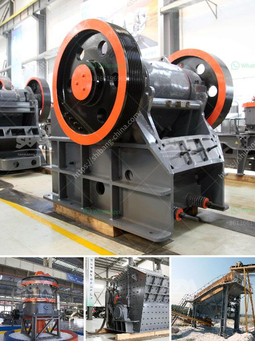

<h3>iron ore concentrate machinery</h3>
Iron ore concentrate is a valuable form of the iron ore that is mined in many parts of the world. The concentrated iron ore is processed in specialized factories that are equipped with technical equipment and machinery for the extraction and production of the iron ore concentrate. The machinery used in this process is specifically designed to leverage the unique properties of the iron ore to produce high-quality concentrate.

One of the most critical pieces of machinery used in the iron ore concentrate production is the ball mill. This machinery grinds the iron ore into a fine powder, allowing for the separation of magnetic material and non-magnetic material. The magnetic material (typically iron fines) is then processed further to extract iron particles through magnet separation.

Another important piece of machinery used in the production of iron ore concentrate is the spiral classifier. This equipment is used to separate the iron ore particles based on their different densities. The heavier particles sink to the bottom while the lighter particles float on top. By adjusting the water flow and the spiral rotation speed, the iron ore concentrate can be effectively separated from the gangue particles.

The magnetic separator is another critical machinery used in the iron ore concentrate production process. This equipment is used to separate the magnetic material from the non-magnetic material. The magnetic separator utilizes the magnetic properties of the iron ore to attract and separate iron particles from the rest of the material. The separated iron particles are then further processed to produce the iron ore concentrate.

To ensure the machinery operates efficiently, periodic maintenance and inspections are required. This involves checking and replacing worn-out parts, lubricating moving parts, and monitoring the overall performance of the machinery. Regular maintenance not only helps to prolong the lifespan of the machinery but also ensures the production process runs smoothly without any unexpected breakdowns.

In recent years, there have been technological advancements in the machinery used for iron ore concentrate production. Automation and computerized control systems have been introduced to streamline the production process and improve efficiency. These systems enable real-time monitoring and adjustment of the machinery, ensuring optimal performance and minimizing human error.

Furthermore, efforts have been made to improve the environmental sustainability of the iron ore concentrate production process. Dust collection systems and water treatment facilities have been implemented to reduce air and water pollution. These measures help to minimize the impact on surrounding ecosystems and ensure compliance with environmental regulations.

In conclusion, the machinery used in the production of iron ore concentrate plays a crucial role in extracting and processing the valuable iron ore. Ball mills, spiral classifiers, and magnetic separators are among the key pieces of equipment used in this process. Regular maintenance and technological advancements have improved the efficiency and sustainability of the machinery. As the demand for iron ore concentrate continues to rise, the development of more advanced and efficient machinery will be essential to meet the growing market demands.
<h3>Contact us</h3><ul><li><strong>Whatsapp:&nbsp;<a href="https://wa.me/8613661969651">+8613661969651</a></strong></li><li><a href="https://swt.shibang-china.com/?git&amp;zhl&amp;iron ore concentrate machinery"><strong>Online Service(chat now)</strong></a></li></ul><h3>Related</h3><ul><li><a href='cost of silica sand mine equipment.md'>cost of silica sand mine equipment</a></li><li><a href='portable gold mining plant pdf.md'>portable gold mining plant pdf</a></li><li><a href='all quarries crushing plants.md'>all quarries crushing plants</a></li><li><a href='financial statements of miningpanies.md'>financial statements of miningpanies</a></li><li><a href='mineral pulverising ball mill manufacturer in india.md'>mineral pulverising ball mill manufacturer in india</a></li></ul>