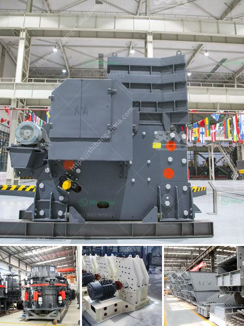

<h3>iron ore crusher</h3>
Iron ore, used in the manufacturing of steel, is one of the most abundant minerals in the world and can be found in many countries including the United States, Australia, China, and Canada. As one of the essential raw materials for the iron and steel industry, iron ore is used in numerous applications such as structural engineering, automotive manufacturing, shipbuilding, electrical appliances, and general machinery.

To obtain iron ore, it is usually beneficiated and crushed through a series of processes. Crushing is a common step in mineral processing and an essential process for the preparation of ore for subsequent extraction stages. Whether you are processing iron ore, coal, rock, salt, wood chips, or clay – to name a few – we have your solution to size reduction.

An iron ore crusher is a machine that is specifically designed to reduce the size of large rocks or gravel into smaller pieces for easier refining in the smelting process. These crushers are able to break down tough and abrasive materials such as granite, limestone, and concrete, which is why they are used in metallurgical and mining industries.

The purpose of an iron ore crusher is to reduce the size of ore into smaller particles to be extracted and refined using equipment like a jaw crusher, cone crusher, or hammer crusher. These pieces are then sent to a secondary crusher to further reduce their size before they are qualified as high-quality ore.

The crusher typically produces either a round or cubic product. For iron ore beneficiation, it is essential to separate impurities and unwanted materials from the ore and achieve a higher iron content. The crushers used in this process would comprise a primary jaw crusher, secondary and tertiary cone crushers.

Crushing can be done in three or four stages, primary (first stage), secondary (second stage), tertiary (third stage), and, in some quarries, a quaternary (fourth stage). Crushed rock, or product, is transported along the process line on an endless conveyor belt, known as the crusher conveyor. The product is then either stockpiled or transported to the processing plant for further refining.

When choosing an iron ore crusher, it is important to ensure that the cone crushers or jaw crushers with a double-toggle mechanism are used. Double-toggle crusher has extra strength in resisting repetitive impacts, and has low maintenance costs and high reliability.

The other important factor to consider when choosing an iron ore crusher is the material being crushed. While many ores are suitable for jaw crushers, such as small-sized materials and materials that are ranging from hard to medium-hard, there are several types of materials that jaw crushers can’t crush properly. These include small-sized ores and materials that are more resilient to pressure, such as limestone, iron ore, and quartzite.

Overall, iron ore crushers have significant advantages over conventional crushers. With advancements in technology, they offer increased efficiency, greater capacity, and reduced consumption of energy. This makes them ideal for the primary crushing stage at a mine where the ore is typically reduced from a size of several meters to a size that is suitable for transportation or feeding to a processing plant.
<h3>Contact us</h3><ul><li><strong>Whatsapp:&nbsp;<a href="https://wa.me/8613661969651">+8613661969651</a></strong></li><li><a href="https://swt.shibang-china.com/?git&amp;zhl&amp;iron ore crusher"><strong>Online Service(chat now)</strong></a></li></ul><h3>Related</h3><ul><li><a href='stone crushing plant project report.md'>stone crushing plant project report</a></li><li><a href='bentonite clay powder process equipment.md'>bentonite clay powder process equipment</a></li><li><a href='flowchart of a stone crushing plant.md'>flowchart of a stone crushing plant</a></li><li><a href='mobile crushing and screening manufacturer in india.md'>mobile crushing and screening manufacturer in india</a></li><li><a href='gypsum powder processing plant india.md'>gypsum powder processing plant india</a></li></ul>