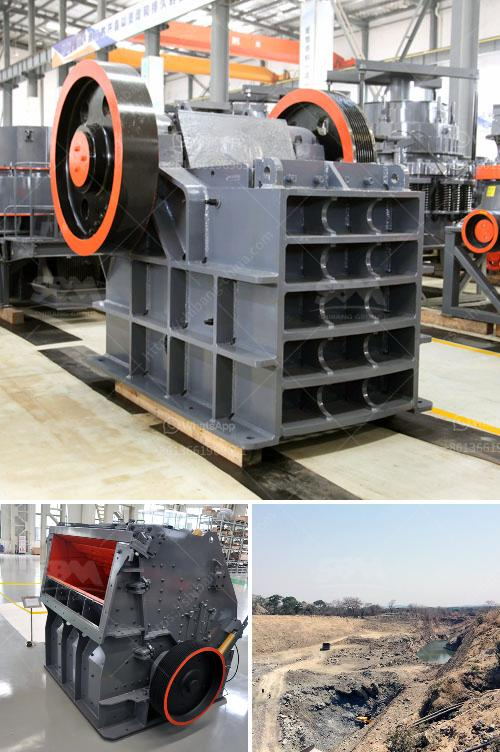

<h3>iron ore crushing and screening</h3>
Iron ore is an important raw material for iron and steel production enterprises. In the iron ore production line, iron ore is evenly sent to jaw crusher for primary crushing, and then sent to vibrating screen for screening. After separation, the oversized material is returned to the crusher for further crushing until the size of the finished product meets the requirements. The materials that meet the requirements are sent to the sand washing machine for cleaning, and then transported by conveyor belt to the finished product stockpile.

The crushing and screening process of iron ore can be divided into two stages: coarse crushing and fine crushing. Large iron ore is uniformly sent to jaw crusher or mobile jaw crusher station by vibrating feeder through silo for coarse crushing; the coarsely crushed iron ore is screened by vibrating screen and sent to the single-cylinder hydraulic cone crusher for fine crushing; the crushed iron ore material is sent to the multi-cylinder hydraulic cone crusher for fine crushing.

Iron ore crushing and screening processes include coarse crushing, medium crushing, and fine crushing operations. In these operations, the crushing process is simple and effective. However, the energy consumption of crushing machinery is also relatively large. Therefore, iron ore crushing and screening manufacturers often choose cone crushers to increase production capacity and reduce costs.

Cone crusher is an ideal equipment for iron ore crushing plant with high crushing efficiency, low energy consumption and less pollution. The unique crushing chamber design makes the material utilization rate higher, and the iron ore particles are evenly distributed in the crushing chamber. The cone crushing effect is excellent, and the laminating crushing principle is more prominent.

The iron ore cone crusher has a good crushing effect on hard materials such as iron ore, basalt, granite, and quartz. In addition, the jaw crusher and cone crusher are used to crush the iron ore particles inside the iron ore production line. Screening and grading equipment is a necessary equipment for the iron ore crushing and screening plant.

With the rapid development of economy, iron ore crushing and screening industry also has a great development. Iron ore crushing and screening plant not only has a wide range of application, variety and advanced technology, but also has a simple structure, high efficiency and energy saving. Therefore, it has been highly praised by the majority of customers. With the continuous progress of technology, various types of iron ore crushing and screening equipment have been refurbished and upgraded, with new technology and processes constantly emerging, making the iron ore crushing and screening equipment more efficient and automated.
<h3>Contact us</h3><ul><li><strong>Whatsapp:&nbsp;<a href="https://wa.me/8613661969651">+8613661969651</a></strong></li><li><a href="https://swt.shibang-china.com/?git&amp;zhl&amp;iron ore crushing and screening"><strong>Online Service(chat now)</strong></a></li></ul><h3>Related</h3><ul><li><a href='sand crusher machine.md'>sand crusher machine</a></li><li><a href='quarry equipment for sale in indonesia.md'>quarry equipment for sale in indonesia</a></li><li><a href='primary crusher machine.md'>primary crusher machine</a></li><li><a href='cone crusher zenith.md'>cone crusher zenith</a></li><li><a href='jaw crusher type sp 100 x.md'>jaw crusher type sp 100 x</a></li></ul>