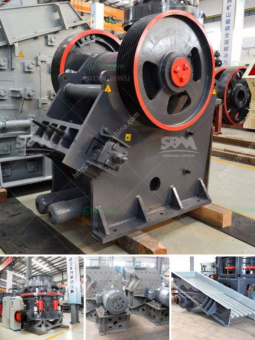

<h3>iron ore heavy duty equipments with photos</h3>
Iron ore is a crucial resource for the global economy, as it is the main ingredient used to produce steel. Extracting and processing iron ore requires the use of heavy-duty equipment, including excavators, haul trucks, crushers, and conveyors. These machines are essential for mining and transporting large amounts of raw materials efficiently.

One of the most common methods of extracting iron ore is through open-pit mining. This method involves removing layers of soil and rock to access the ore deposits below the surface. To accomplish this, massive excavators are used to loosen and remove the overburden, which is the material above the ore. These machines can have bucket capacities of up to 70 cubic meters and are capable of excavating thousands of tons of material per hour.

Once the overburden is removed, haul trucks are employed to transport the ore to the processing plant. These trucks can carry loads weighing several hundred tons and are equipped with powerful engines to handle the demanding conditions of a mining site. Some of the largest haul trucks used in iron ore mining have tires taller than an average adult.

Crushing the mined ore into smaller particles is another important step in the iron ore processing chain. Heavy-duty crushers are utilized to break down the large chunks of ore into more manageable pieces. These machines use powerful jaws or impactors, depending on the desired size of the end product. The crushed ore is then transported on conveyor belts to the next stage of processing.

Conveyors play a critical role in transporting the iron ore from one processing station to another. These belt systems are designed to carry heavy loads over long distances and can operate at high speeds. They are often equipped with advanced control systems to ensure the efficient movement of materials. Conveyors can be horizontal or inclined, allowing for flexible routing across the mining site.

In addition to the above equipment, other heavy-duty machinery, such as loaders, dozers, and drills, is also used in iron ore mining and processing. These machines work in tandem to ensure a continuous flow of ore throughout the production process.

As the demand for steel continues to rise, so does the need for efficient and reliable iron ore processing equipment. Manufacturers are constantly investing in research and development to design and produce more robust and technologically advanced machines. These advancements not only increase productivity but also enhance worker safety and minimize environmental impact.

In conclusion, the extraction and processing of iron ore rely heavily on heavy-duty equipment. Excavators, haul trucks, crushers, and conveyors are just a few examples of the machines used in this industry. These machines enable efficient and cost-effective mining operations, ensuring a steady supply of iron ore for steel production. With ongoing technological advancements, the future of iron ore mining looks promising, delivering valuable resources to support global economic growth.
<h3>Contact us</h3><ul><li><strong>Whatsapp:&nbsp;<a href="https://wa.me/8613661969651">+8613661969651</a></strong></li><li><a href="https://swt.shibang-china.com/?git&amp;zhl&amp;iron ore heavy duty equipments with photos"><strong>Online Service(chat now)</strong></a></li></ul><h3>Related</h3><ul><li><a href='how much does sand processing plant cost.md'>how much does sand processing plant cost</a></li><li><a href='coal powder making.md'>coal powder making</a></li><li><a href='manufacturer jaw crusher.md'>manufacturer jaw crusher</a></li><li><a href='crushing of coal process.md'>crushing of coal process</a></li><li><a href='crushers of cone ethiopia.md'>crushers of cone ethiopia</a></li></ul>