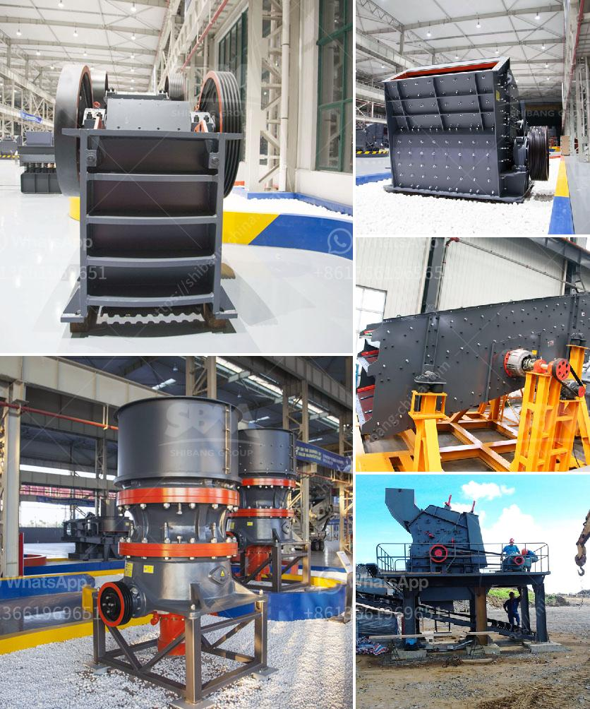

<h3>iron ore vibrator screen</h3>
Iron Ore Vibrating Screen is an increasingly popular iron ore mining tool used to screen iron ore in various mining processes, such as mining, separating, and concentrating. It utilizes a vibrating motor to facilitate the movement of ores across the screen and separate desirable materials from unwanted ones. An efficient and reliable iron ore vibrating screen is crucial for the continuous and effective operation of any mining operation.

The role of a vibrating screen in iron ore processing is to remove impurities, improve the ore grade, and reach the desired specifications for the end-use of a product. This makes iron ore vibrating screens essential in the iron ore mining industry for determining the size of the material to separate it into different grades.

Advancements in technology have paved the way in enhancing the design and efficiency of vibrating screens, making the process faster and more accurate. Modern vibrating screens generally consist of a sturdy frame, an eccentric shaft, a motor, a screen mesh, a vibration-damping support system, and a grouping of springs. These components work together to accurately and efficiently screen iron ore, delivering a consistent product.

The vibrating screen's mechanism is driven by the vibration motor that generates vibration energy to actuate the screen deck, creating complex and simultaneous circular, elliptical, and linear vibrations. This motion efficiently loosens sticky fines particles and reduces their adhesion to the screen media. The vibrating motion also stratifies the materials and sieves them, undersize and oversize.

However, the key to an efficient and reliable iron ore vibrating screen operation lies in maintaining proper screen media engagement. This is achieved by using high-quality screen media that can withstand the abrasive nature of iron ore and prevent blinding, pegging, or any other issues that may hinder the screening process.

Several types of screen media can be used for iron ore vibrating screens, such as stainless steel, high carbon steel, and polyurethane. Stainless steel and high carbon steel are known for their durability and resistance to corrosion and abrasion, making them suitable for heavy-duty applications. Polyurethane offers excellent wear resistance and elasticity, making it ideal for iron ore vibrating screens where noise reduction and screening efficiency are crucial.

In the mining industry, iron ore vibrating screens are commonly used as the final stage in the production process, ensuring the correct product specification and quality. Iron ore vibrating screens can be circular or linear in design and come in a variety of sizes, from small units suitable for laboratory use to larger screens capable of handling high tonnages.

In conclusion, iron ore vibrating screens have been widely used in the iron ore mining industry for efficient screening of unwanted materials and ensuring the proper size consistency of the ore. The iron ore vibrating screen utilizes vibration to filter the ore and improve its grade, recovering valuable minerals and maximizing yield. With an increasing number of iron ore vibrating screen manufacturers, suppliers, and consumers on the market, competition is fierce, making it essential for companies to provide exact specifications and global-standard quality. By selecting the appropriate vibrating screen and screen media, mining companies can improve their productivity, reduce operational costs, and enhance the quality of their end-products.
<h3>Contact us</h3><ul><li><strong>Whatsapp:&nbsp;<a href="https://wa.me/8613661969651">+8613661969651</a></strong></li><li><a href="https://swt.shibang-china.com/?git&amp;zhl&amp;iron ore vibrator screen"><strong>Online Service(chat now)</strong></a></li></ul><h3>Related</h3><ul><li><a href='supplier of granite crusher.md'>supplier of granite crusher</a></li><li><a href='hand powered rock crusher binq mining.md'>hand powered rock crusher binq mining</a></li><li><a href='used ball milling machine for sale canada.md'>used ball milling machine for sale canada</a></li><li><a href='vertical mill mining.md'>vertical mill mining</a></li><li><a href='gold mining machinery.md'>gold mining machinery</a></li></ul>